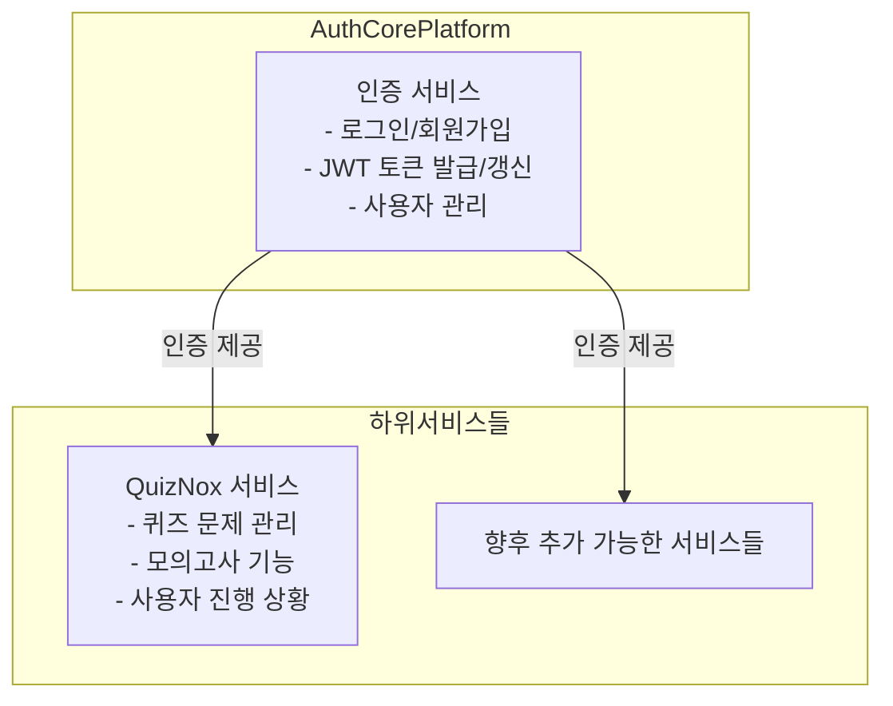
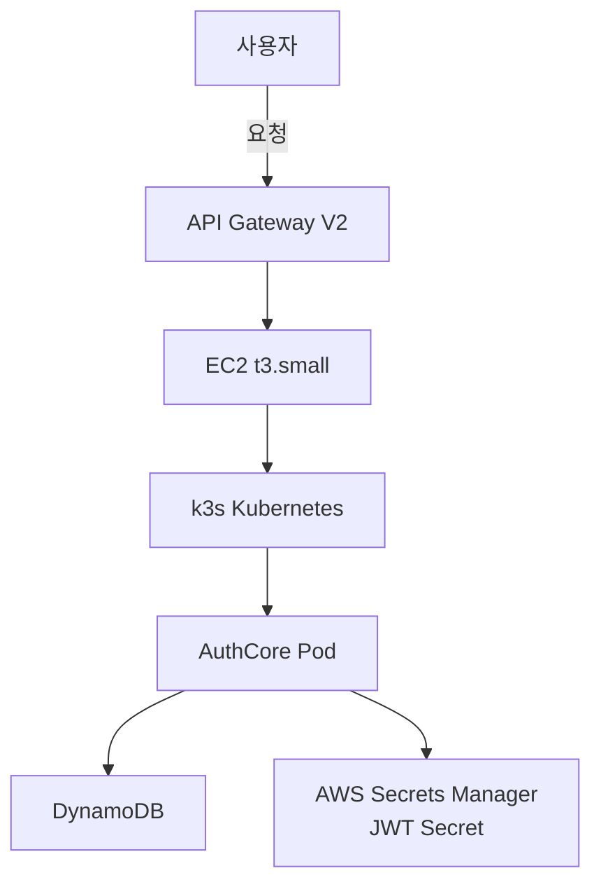
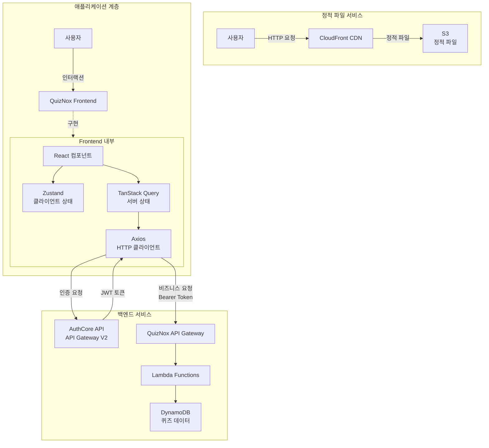
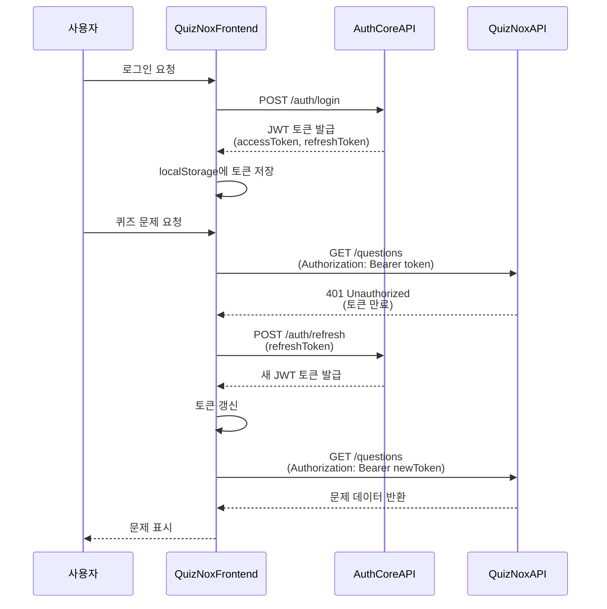
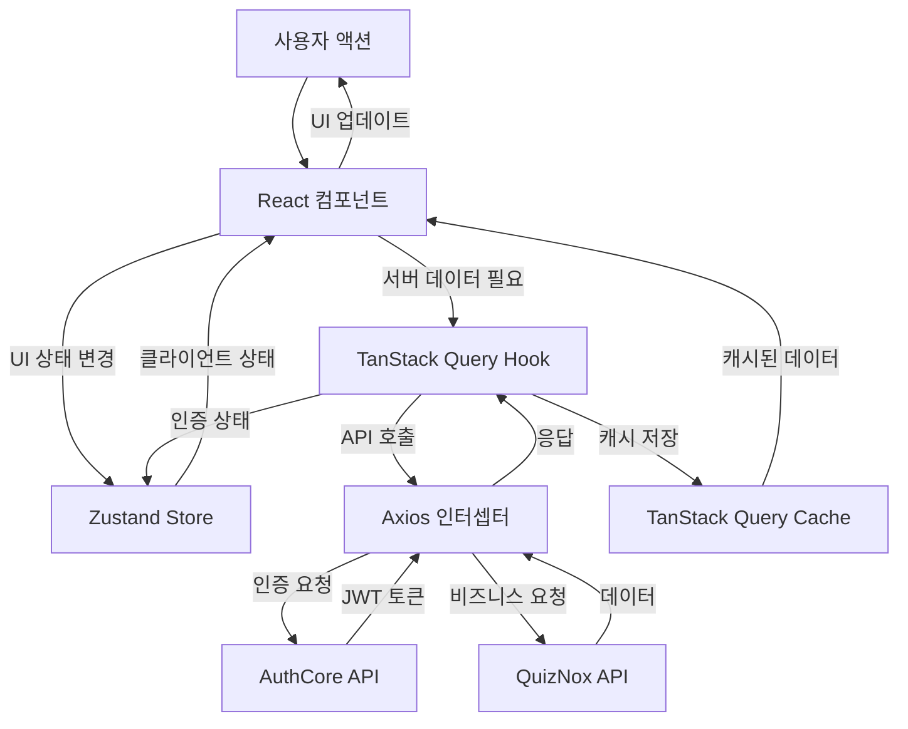

## 1) 소개

QUIZNOX는 **핸드북**(개념 정리·다이어그램), 토픽별 **기출문제**, **모의고사** 기능을 제공하며, 회원가입/로그인/로그아웃을 포함한 완전한 인증 흐름을 제공합니다.

## 2) 사용법

- **핸드북**: `핸드북`에서 레이어(Core CS, AWS 공통, SAA, DVA, SOA)를 선택한 뒤, 다이어그램에서 노드를 클릭하면 해당 개념 문서로 이동합니다. 문서 상단의 "← 이전 (다이어그램)"으로 해당 섹션 위치로 돌아갈 수 있습니다.
- **기출문제**: `기출문제`에서 토픽을 선택해 퀴즈를 풉니다.
- **모의고사**: `모의고사`에서 랜덤 추출된 문항으로 시험을 진행합니다.(모바일 사용불가)
- 로그인 후 우상단 프로필 메뉴에서 `로그아웃`을 수행할 수 있습니다.

## 3) 기술 아키텍처 및 설계

<strong>📋 기술 스택, 아키텍처, 설계 의사결정 보기</strong>

### 전체 시스템 아키텍처

QuizNox는 **AuthCore 플랫폼** 하위의 비즈니스 서비스로 구성된 MSA(Microservices Architecture) 구조를 따릅니다.

<!-- 전체 시스템 아키텍처 다이어그램 -->

**MSA 아키텍처 채택 근거**

- **서비스 독립성**: 각 서비스를 독립적으로 배포 및 확장 가능
- **기술 스택 다양성**: 서비스별로 최적의 기술 선택 가능
- **확장성**: 새로운 비즈니스 서비스를 AuthCore 하위에 추가 가능
- **장애 격리**: 한 서비스의 장애가 다른 서비스에 직접적인 영향을 주지 않음

---

### 🔐 AuthCore 플랫폼

**AuthCore**는 여러 플랫폼에 연동 가능한 인증 서비스를 제공하는 컨테이너 오케스트레이션 기반 API입니다.

#### AuthCore 아키텍처

AuthCore 플랫폼의 인프라 구조와 컴포넌트 간의 관계를 보여줍니다.

<!-- AuthCore 아키텍처 다이어그램 -->

**기술 스택 및 선택 근거**

**애플리케이션**

- **Fastify (`^4.21.0`)**: Express 대비 2배 빠른 성능, 낮은 메모리 사용량으로 EC2 리소스 효율적 활용
- **DynamoDB**: 서버리스 환경에 최적화된 NoSQL, 자동 스케일링으로 트래픽 변동 대응
- **JWT**: 상태 비저장 인증으로 서버 부하 감소, 마이크로서비스 간 인증 정보 공유 용이
- **bcryptjs**: 비밀번호 해싱 표준 라이브러리, 보안성과 성능의 균형
- **@aws-sdk v3**: 최신 AWS SDK로 번들 크기 감소, 모듈화된 구조로 필요한 기능만 import

**인프라 및 운영**

- **k3s**: 경량 Kubernetes로 EC2 t3.small에서도 안정적 운영, 리소스 효율적 사용
- **Podman**: rootless 컨테이너로 보안 강화, Docker 대비 경량화
- **Terraform**: Infrastructure as Code로 인프라 관리 자동화 및 버전 관리
- **AWS API Gateway V2**: HTTP API로 비용 절감 및 낮은 지연시간
- **AWS Secrets Manager**: JWT Secret 등 민감 정보를 코드와 분리하여 보안 강화
- **GitHub Actions**: CI/CD 자동화를 통한 코드 품질 검사 및 자동 배포
  - **테스트 단계**: Node.js 환경에서 Unit 테스트 및 Integration 테스트 실행, Codecov를 통한 코드 커버리지 모니터링
  - **빌드 및 푸시 단계**: Podman을 사용하여 컨테이너 이미지 빌드 및 AWS ECR에 푸시
  - **배포 단계**: k3s Kubernetes 클러스터에 자동 배포, API Gateway 백엔드 업데이트, 배포 검증. Terraform output과 AWS CLI를 통해 인프라 값(EC2 Public IP, API Gateway ID, Secrets Manager ARN 등)을 자동으로 조회하며, JWT Secret은 Secrets Manager에서 자동으로 가져옵니다. 필수 GitHub Secrets는 AWS 자격 증명(`AWS_ACCESS_KEY_ID`, `AWS_SECRET_ACCESS_KEY`)과 EC2 접근용 SSH 키(`SSH_PRIVATE_KEY`) 3개만 필요합니다.

**주요 기능**

- ✅ 사용자 회원가입 및 로그인
- ✅ JWT 기반 인증 (Access Token + Refresh Token)
- ✅ 비밀번호 해싱 (bcrypt)
- ✅ Rate Limiting
- ✅ CORS 지원
- ✅ Health Check 엔드포인트

**보안**

- JWT Secret은 AWS Secrets Manager에 저장
- SSH 키는 GitHub Secrets로 관리
- 컨테이너는 rootless 모드로 실행 (Podman)

**비용**

- **EC2**: t3.small (2GB RAM) - ~$15-20/월
- **기타**: DynamoDB, API Gateway, ECR, S3 등 (사용량 기반)

**서버리스 대안으로 EC2 선택 근거**

- **콜드 스타트 제거**: 인증 서비스는 항상 즉시 응답 가능해야 하므로 Lambda의 콜드 스타트는 부적합
- **안정적인 성능**: 일정한 트래픽에 대해 예측 가능한 성능 제공

---

### 📚 QuizNox 서비스

QuizNox는 AuthCore 플랫폼의 인증 서비스를 활용하여 퀴즈 문제 풀이 및 모의고사 기능을 제공하는 비즈니스 서비스입니다.

#### QuizNox 서비스 아키텍처

QuizNox 서비스의 전체 아키텍처는 정적 파일 서비스, 애플리케이션 계층, 백엔드 서비스로 구성됩니다.

<!-- QuizNox 서비스 아키텍처 다이어그램 -->

**기술 스택 및 선택 근거**

**애플리케이션**

**프론트엔드**

- **React 19**: 최신 Concurrent Features로 사용자 경험 개선, 자동 배치 처리로 성능 향상
- **Vite 6**: 빠른 개발 서버 시작, HMR(Hot Module Replacement)로 개발 생산성 향상
- **TypeScript 5**: 타입 안정성으로 런타임 에러 감소, 코드 자동완성 및 리팩토링 용이
- **Zustand**: Redux 대비 보일러플레이트 최소화, 간단한 API로 클라이언트 상태 관리 단순화
- **TanStack Query v5**: 서버 상태 캐싱 자동화, 중복 요청 제거, 백그라운드 업데이트로 UX 개선
- **React Router DOM v7**: 최신 라우팅 기능, 데이터 로더로 SSR 준비
- **Axios**: 인터셉터를 통한 JWT 토큰 자동 관리, 요청/응답 변환 및 에러 처리 통합
- **Tailwind CSS 3**: 유틸리티 기반 스타일링으로 개발 속도 향상, 번들 크기 최적화
- **pnpm**: 디스크 공간 효율적 사용, 엄격한 의존성 관리로 phantom dependency 방지

**백엔드**

- **AWS Lambda**: 사용량 기반 과금으로 비용 최적화, 자동 스케일링으로 트래픽 변동 대응
- **API Gateway**: Lambda와 통합된 서버리스 API 관리, 인증/인가, Rate Limiting 제공
- **Serverless Framework**: 인프라 코드화로 배포 자동화, 로컬 테스트 환경 제공
- **DynamoDB**: 서버리스 환경에 최적화, 자동 백업 및 복구, 글로벌 테이블 지원
- **Fastify + serverless-http**: 기존 애플리케이션 구조 유지하며 Lambda에 적용, 콜드 스타트 최소화

**인프라 및 운영**

- **S3 + CloudFront**: 정적 파일 호스팅, 글로벌 CDN으로 로딩 속도 개선
- **GitHub Actions**: CI/CD 자동화를 통한 코드 품질 검사 및 자동 배포
  - **Frontend 파이프라인**: `build → S3 sync → CloudFront invalidation` 순서로 자동 배포가 진행됩니다. 코드 변경 시 자동 배포로 배포 시간을 단축하고 수동 작업 오류를 방지하여 배포 프로세스를 표준화하고 롤백을 용이하게 합니다.
  - **Backend 파이프라인**: 테스트 통과 조건 기반 CI/CD 파이프라인으로, CodeCov 연동을 통한 코드 커버리지 모니터링과 Serverless Framework 기반 배포 자동화를 제공합니다. 테스트 실패 시 배포를 차단하여 프로덕션 안정성을 확보하고 배포 신뢰성과 코드 품질을 유지합니다.

**주요 기능**

- ✅ 토픽별 퀴즈 문제 풀이
- ✅ 퀴즈 목록 조회 및 검색
- ✅ 모의고사 기능 (랜덤 문제 추출)
- ✅ 사용자 진행 상황 관리
- ✅ AuthCore 연동 인증

**보안**

- JWT 토큰은 AuthCore 플랫폼에서 발급 및 검증
- Axios 인터셉터를 통한 자동 토큰 갱신으로 인증 상태 유지
- HTTPS를 통한 모든 통신 암호화 (CloudFront, API Gateway)
- CORS 정책을 통한 크로스 오리진 요청 제어

**비용**

- **S3 + CloudFront**: 정적 파일 호스팅 및 CDN - 사용량 기반 (~$1-5/월)
- **Lambda**: 요청 수 및 실행 시간 기반 과금 - 사용량 기반 (~$0-10/월)
- **API Gateway**: API 호출 수 기반 과금 - 사용량 기반 (~$0-5/월)
- **DynamoDB**: 읽기/쓰기 용량 및 스토리지 기반 과금 - 사용량 기반 (~$0-5/월)
- **기타**: GitHub Actions (무료 플랜), 기타 AWS 서비스 (사용량 기반)

**서버리스 아키텍처 채택 근거**

- **비용 최적화**: 상시 실행 서버 제거로 비용 최소화, 트래픽 변동에 따른 자동 스케일링
- **운영 부담 감소**: 인프라 관리 부담 제거, 사용량 기반 과금으로 비용 최적화
- **확장성**: 트래픽 증가 시 자동으로 스케일링되어 안정적인 서비스 제공

---

### 인증 플로우

인증 플로우는 사용자 로그인부터 토큰 갱신까지의 전체 과정을 시퀀스 다이어그램으로 표현합니다.

<!-- 인증 플로우 다이어그램 -->

**토큰 관리 전략**

- **Axios 인터셉터**: 모든 요청에 자동으로 Authorization 헤더 추가
- **자동 토큰 갱신**: 401 응답 시 refreshToken으로 자동 갱신 후 원래 요청 재시도
- **localStorage 저장**: 클라이언트 측 토큰 관리 (XSS 공격에 취약하지만 구현 단순화)

---

### 데이터 플로우

데이터 플로우는 프론트엔드 내부에서 사용자 액션부터 API 호출, 상태 관리까지의 데이터 흐름을 보여줍니다.

<!-- 데이터 플로우 다이어그램 -->

**상태 관리 전략**

- **Zustand (클라이언트 상태)**: UI 상태, 사용자 설정 등 클라이언트 전용 상태 관리
- **TanStack Query (서버 상태)**: 서버 데이터 캐싱, 자동 리패칭, 중복 요청 제거
- **명확한 역할 분담**: 각 상태 관리 도구의 책임을 명확히 분리하여 코드 복잡도 감소

---

## 📒 패치 이력

  
2026-02-07 핸드북 기능 신규 추가

  
  #### 📚 핸드북 기능 개요
  
  - **근거**: AWS/CS 시험 대비 개념을 체계적으로 정리하고, 다이어그램으로 구조를 한눈에 볼 수 있는 학습 경로 제공 필요
  - **구현**: 5개 레이어(Core CS, AWS 공통, SAA, DVA, SOA) 구조의 핸드북 도입. 각 레이어별 overview 다이어그램(Mermaid) 및 섹션별 개념 문서(Markdown) 제공. 다이어그램 노드 클릭 시 해당 문서로 이동, 문서에서 "← 이전 (다이어그램)"으로 해당 섹션 위치로 스크롤 복귀. 레이어별 콘텐츠 캐시로 챕터 전환 시 깜박임 최소화. 네비게이션에 핸드북 메뉴 추가(홈 → 핸드북 → 기출문제 → 모의고사)
  - **효과**: 개념 학습과 기출문제를 연계한 학습 흐름 구축, 시험 범위별 정리된 참고 자료 제공

  
2026-01-24 AuthCore 마이그레이션 및 README 개선

  
  #### 🔄 AuthCore 서버리스 → EC2 k3s 마이그레이션
  
  - **근거**: 인증 서비스는 항상 즉시 응답 가능해야 하므로 Lambda의 콜드 스타트는 부적합, 일정한 트래픽에 대해 예측 가능한 성능 제공 필요
  - **구현**: AuthCore 플랫폼을 서버리스 아키텍처(Lambda)에서 EC2 기반 k3s Kubernetes로 마이그레이션,
    Podman을 사용한 rootless 컨테이너 실행, Terraform을 통한 인프라 코드화, GitHub Actions CI/CD 파이프라인 구축,
    AWS Secrets Manager를 통한 JWT Secret 관리, API Gateway V2 백엔드 연동
  - **효과**: 콜드 스타트 제거로 안정적인 인증 성능 확보, 소규모 서비스에서는 EC2가 Lambda보다 비용 효율적,
    컨테이너 오케스트레이션을 통한 확장성 및 관리 용이성 향상, 인증 서비스의 안정성 및 신뢰성 개선
  
  #### 📝 README 구조 통일 및 개선
  
  - **근거**: AuthCore 플랫폼과 QuizNox 서비스 섹션의 구조가 불일치하여 가독성 저하, CI/CD 내용이 분산되어 있음
  - **구현**: AuthCore 플랫폼과 QuizNox 서비스 섹션을 동일한 구조로 통일 (아키텍처 다이어그램, 기술 스택 및 선택 근거, 주요 기능, 보안, 비용, 아키텍처 선택 근거),
    CI/CD 내용을 각 서비스의 "인프라 및 운영" 섹션으로 자연스럽게 통합, AuthCore 플랫폼에 CI/CD 파이프라인 상세 정보 추가,
    QuizNox 서비스에 보안 및 비용 섹션 추가, Mermaid 다이어그램 겹침 문제 해결 (고유한 노드 ID 접두사 적용, Home.tsx 렌더링 로직 개선)
  - **효과**: 두 서비스 섹션의 일관성 확보로 가독성 향상, CI/CD 정보가 각 서비스의 인프라 섹션에 자연스럽게 통합,
    Mermaid 다이어그램이 독립적으로 렌더링되어 시각적 이해도 개선, 보안 및 비용 정보 추가로 프로젝트 이해도 향상

  
2026-01-11 README 업데이트

  
 - 근거: README에 서버리스 아키텍처, CI/CD 구성, 설계 의사결정 등 누락된 내용 보완 필요
 - 구현: 기술 스택 섹션에 Backend 정보 추가, 주요 설계 및 의사결정 섹션 신설,
   CI/CD 및 운영 자동화 섹션 추가
 - 효과: 프로젝트의 전체적인 아키텍처와 운영 방식을 문서화하여 가독성 향상

  
2025-10-07 프론트엔드 개선 및 CI/CD 업데이트

  
  #### 🎨 로딩 UX 통합
  
  - **근거**: 전면 스피너로 인한 깜빡임/가림 → UX 저하
  - **구현**: LoadingOverlay(파란 테마), ProtectedRoute 오버레이, 로그인/로그아웃 맞춤 메시지
  - **효과**: 화면 전환 자연스러움 개선, 스피너 노출 시간 감소, 로그인/로그아웃 전환 안정성 향상
  
  #### 🔄 상태 관리/데이터 패칭 마이그레이션
  
  - **근거**: Redux 보일러플레이트/복잡성 → 단순하고 타입 친화적인 대안 필요
  - **구현**: Redux → Zustand, Axios + TanStack Query 도입, 모의고사 쿼리 키/캐시 전략 개선
  - **효과**: 불필요 네트워크 요청 감소, 재렌더 횟수 감소, 쿼리 캐시 효율 향상, 코드량 감소
  
  #### ⚙️ CI 및 PWA 메타 업데이트
  
  - **근거**: CI 속도/일관성 향상, 최신 표준 준수
  - **구현**: GitHub Actions pnpm 전환, mobile-web-app-capable 메타 적용
  - **효과**: CI 파이프라인 시간 단축, 의존성 설치 속도 개선, 초기 구동 TTI 개선

