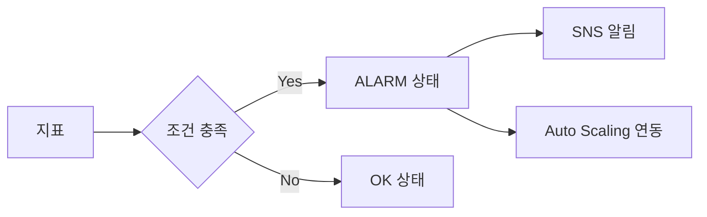

# CloudWatch Alarm

**지표가 조건을 만족**하면 상태를 ALARM으로 바꾸고, SNS 알림·Auto Scaling 연동 등 **알림·동작**을 수행하는 CloudWatch 설정입니다.

---

## 1. 동작

- **지표·조건**(임계값, 기간, 샘플 수) 설정
- 조건 충족 시 **OK / ALARM** 상태 전환
- SNS 알림, Auto Scaling 연동, 이벤트 등 액션 연결 가능

---

## 2. 상태

- OK: 조건 미충족
- ALARM: 조건 충족
- INSUFFICIENT_DATA: 데이터 부족

---

---

## 요약

| 항목 | 설명 |
|------|------|
| 동작 | 지표·조건 설정 → 충족 시 ALARM 상태 → SNS·ASG 등 액션 |
| 상태 | OK, ALARM, INSUFFICIENT_DATA |
