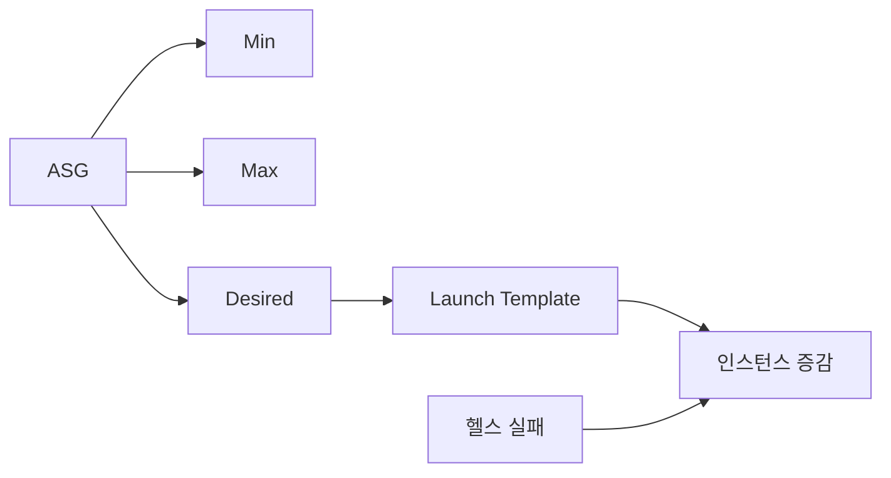

# ASG 기본 (Auto Scaling Group)

**원하는 대수(Min/Max/Desired)** 를 두고, **헬스·스케일 정책**에 따라 인스턴스를 자동으로 늘리거나 줄이는 서비스입니다.  
Launch Template(또는 구 Launch Configuration)으로 **어떤 인스턴스를 띄울지** 정의합니다.

---

## 1. Min / Max / Desired

- **Min**: 최소 유지 인스턴스 수
- **Max**: 최대까지 늘릴 수 있는 수
- **Desired**: 목표 대수, ASG가 이 수를 유지하려고 스케일 인/아웃

---

## 2. Launch Template

- **AMI·인스턴스 타입·스토리지·보안 그룹** 등 새 인스턴스 설정
- ASG는 이 템플릿으로 새 인스턴스를 기동

---

## 3. 동작

- **헬스 체크** 실패 시 해당 인스턴스 제거 후 필요하면 새 인스턴스 기동
- **스케일링 정책**(Target tracking, Step, Scheduled)에 따라 Desired 변경 → 인스턴스 증감

---

---

## 요약

| 항목 | 설명 |
|------|------|
| ASG | Min/Max/Desired에 맞춰 인스턴스 자동 증감 |
| Launch Template | 새 인스턴스의 AMI·타입·설정 |
| 정책 | Target tracking, Step, Scheduled 등으로 Desired 조정 |
