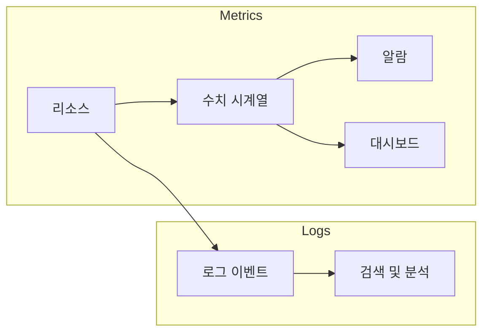

# CloudWatch Metrics / Logs

AWS 리소스와 애플리케이션의 **지표(Metrics)** 와 **로그(Logs)** 를 수집·저장·조회하는 서비스입니다. 알람·대시보드·검색의 기반이 됩니다.

---

## 1. Metrics

- **숫자 지표** 시계열: CPU, 디스크, 커스텀 지표
- 네임스페이스·차원으로 구분, 알람·대시보드에 사용

---

## 2. Logs

- **로그 이벤트** 수집·저장·검색
- 로그 그룹·스트림 단위, 만료 정책·메트릭 필터 설정 가능

---

---

## 요약

| 구분 | Metrics | Logs |
|------|---------|------|
| 형태 | 수치 시계열 | 로그 이벤트 |
| 용도 | 알람·대시보드 | 검색·분석·보관 |
