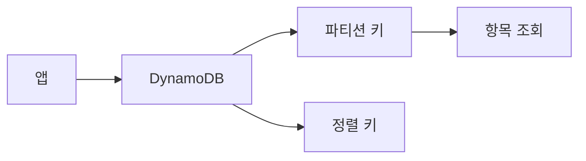

# DynamoDB 기본

**키·값 기반 NoSQL** 관리형 DB 서비스입니다. 파티션 키(필수)·정렬 키(선택)로 테이블을 설계하고, **프로비저닝 또는 온디맨드** 용량으로 읽기·쓰기 처리량을 설정합니다.

---

## 1. 특징

- **NoSQL**: 스키마 유연, 파티션 키·정렬 키로 항목 접근
- **관리형**: 서버·패치 없이 테이블 생성 후 읽기·쓰기만 사용
- **내구성·가용성**: 다중 AZ 복제, 백업·포인트인타임 복구 옵션

---

## 2. 핵심 개념

- **테이블**: 항목(Item) 모음
- **파티션 키**: 항목을 구분하는 기본 키, 같은 파티션 키는 같은 파티션에 저장
- **정렬 키**: 파티션 키와 함께 복합 기본 키, 파티션 내 정렬·범위 조회
- **RCU·WCU**: 읽기·쓰기 용량 단위(프로비저닝 모드) 또는 온디맨드 과금

---

## 3. RDS와 비교

| 구분 | RDS | DynamoDB |
|------|-----|----------|
| 모델 | 관계형(SQL) | NoSQL(키·값) |
| 스키마 | 고정 테이블·컬럼 | 유연, 항목별 속성 가능 |
| 용도 | JOIN·트랜잭션·복잡 쿼리 | 단순 키 조회·고처리량·저지연 |

---

---

## 요약

| 항목 | 설명 |
|------|------|
| DynamoDB | 관리형 NoSQL(키·값) DB |
| 키 | 파티션 키(필수), 정렬 키(선택) |
| 용량 | 프로비저닝(RCU·WCU) 또는 온디맨드 |
| 용도 | 고처리량·저지연·스키마 유연 |