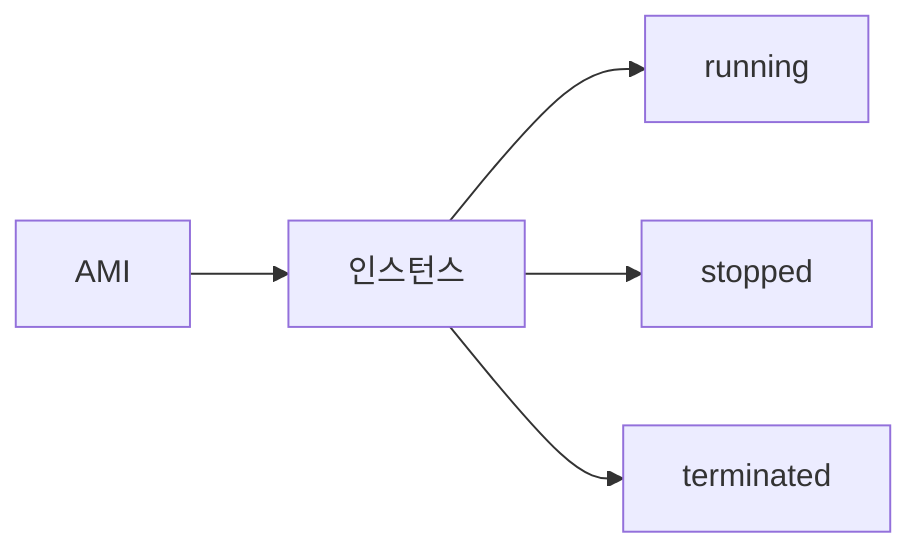

# EC2 개요 (인스턴스 · AMI · 상태)

**가상 서버**를 프로비저닝하고 **AMI**로 템플릿부터 띄우는 AWS 컴퓨트 서비스입니다.  
인스턴스 타입(vCPU·메모리)·상태(running, stopped 등)를 이해하면 비용·운영에 도움이 됩니다.

---

## 1. 인스턴스 타입

- **패밀리**: 범용(t, m), 컴퓨트(c), 메모리(r), 스토리지(i, d) 등
- **vCPU·메모리·네트워크** 성능이 타입별로 정해짐
- 예: t3.micro(소규모), m5.large(범용 중형)

---

## 2. 인스턴스 상태

- **running**: 실행 중, 과금
- **stopped**: 중지, EBS 등 스토리지만 과금
- **terminated**: 삭제 예정/삭제됨
- **pending**: 부팅 중

---

## 3. AMI (Amazon Machine Image)

- **OS·소프트웨어가 포함된** 이미지, 인스턴스 생성 시 선택
- 자체 AMI 만들기: 인스턴스에서 이미지 생성 → 다른 인스턴스·리전에서 재사용

---

---

## 요약

| 항목 | 설명 |
|------|------|
| EC2 | 가상 서버(인스턴스) 프로비저닝 |
| 타입 | vCPU·메모리·용도별 패밀리 선택 |
| AMI | 인스턴스 템플릿(OS·앱 포함) |
| 상태 | running(과금), stopped, terminated |
