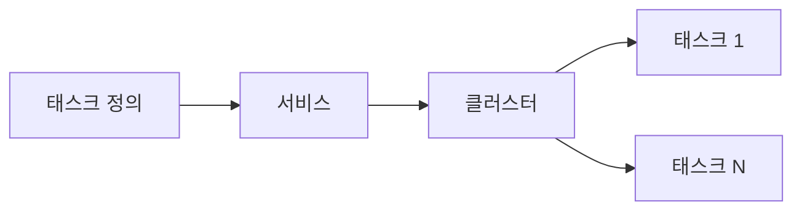

# ECS 기본 (Elastic Container Service)

**Docker 컨테이너**를 오케스트레이션하는 AWS 관리형 서비스입니다. 태스크 정의(이미지·CPU·메모리)·서비스(원하는 대수 유지)·클러스터로 컨테이너를 실행·확장합니다.

---

## 1. 핵심 개념

- **클러스터**: 태스크를 담는 논리 단위
- **태스크 정의**: 컨테이너 이미지·CPU·메모리·환경 변수 등 한 번에 실행할 단위
- **서비스**: 태스크 정의를 기준으로 원하는 개수 유지, 로드 밸런서 연동

---

## 2. 실행 옵션

- **EC2 런타임**: EC2 인스턴스 위에 ECS 에이전트로 태스크 실행
- **Fargate**: 서버리스, 인스턴스 관리 없이 태스크만 실행

---

## 3. 용도

- 마이크로서비스·컨테이너 워크로드
- CI/CD와 연동한 배포
- EC2보다 컨테이너 중심 운영에 적합

---

---

## 요약

| 항목 | 설명 |
|------|------|
| ECS | AWS 관리형 컨테이너 오케스트레이션 |
| 단위 | 클러스터 → 서비스 → 태스크(컨테이너) |
| 실행 | EC2 런타임 또는 Fargate(서버리스) |