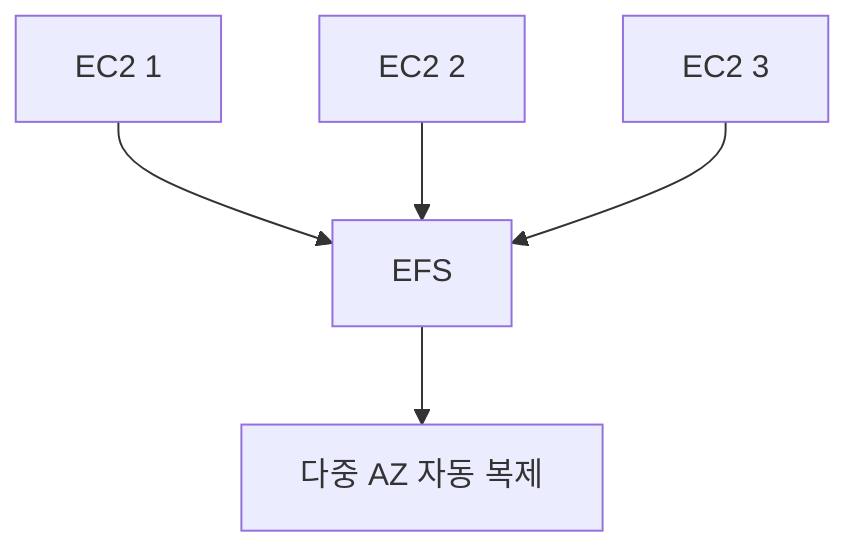

# EFS 기본 (Elastic File System)

**여러 EC2(또는 Lambda·ECS 등)가 동시에 마운트해서 쓰는** 관리형 **공유 파일 스토리지(NFS)** 입니다.  
EBS는 한 인스턴스에만 붙지만, EFS는 **다중 AZ·다중 인스턴스**에서 같은 파일 시스템을 공유할 때 씁니다.

---

## 1. 특징

- **NFS 프로토콜**: Linux에서 마운트해 디렉터리처럼 사용
- **다중 AZ**: 한 리전 내 여러 AZ에서 동시 접근, 자동 복제
- **페이고(자동) 확장**: 넣은 만큼 용량 사용, 미리 프로비저닝 불필요

---

## 2. 용도

- 웹 서버 여러 대가 같은 정적·업로드 파일 공유
- 컨테이너·Lambda에서 공유 스토리지 필요 시
- EBS는 1인스턴스 전용, 공유가 필요하면 EFS

---

---

## 요약

| 항목 | 설명 |
|------|------|
| EFS | 관리형 공유 파일 스토리지(NFS) |
| 접근 | 다중 EC2·Lambda·ECS 동시 마운트 |
| EBS와 차이 | EBS=1인스턴스, EFS=공유·다중 AZ |
