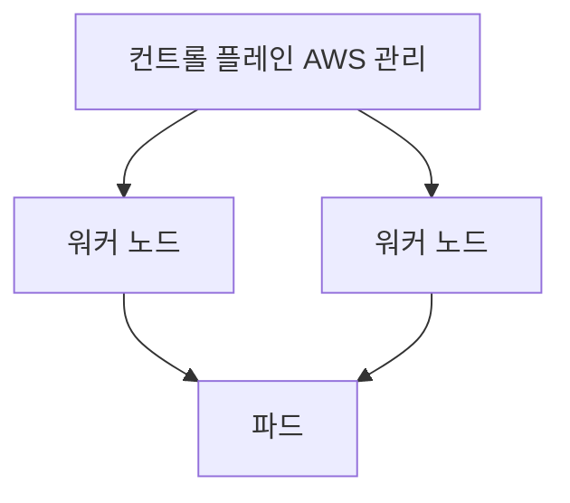

# EKS 기본 (Elastic Kubernetes Service)

**관리형 Kubernetes** 서비스입니다. AWS가 컨트롤 플레인(마스터)을 운영하고, 사용자는 워커 노드(EC2 또는 Fargate)를 붙여 **표준 Kubernetes**로 파드·서비스를 배포합니다.

---

## 1. 특징

- **Kubernetes 호환**: kubectl, Helm, YAML 매니페스트 그대로 사용
- **관리형 컨트롤 플레인**: 마스터 노드 패치·가용성은 AWS 책임
- **워커 노드**: EC2(자체 관리) 또는 Fargate(서버리스) 선택

---

## 2. 구성 요소

- **클러스터**: 컨트롤 플레인 + 워커 노드 묶음
- **노드 그룹**: EC2 워커 노드 묶음, ASG로 확장
- **파드·디플로이먼트·서비스**: 표준 K8s 리소스

---

## 3. 용도

- 이미 Kubernetes를 쓰는 워크로드 이전
- 멀티 테넌트·마이크로서비스 오케스트레이션
- ECS보다 K8s 생태계·표준이 필요할 때

---

---

## 요약

| 항목 | 설명 |
|------|------|
| EKS | AWS 관리형 Kubernetes |
| 컨트롤 플레인 | AWS 관리, 패치·가용성 AWS 책임 |
| 워커 | EC2 노드 그룹 또는 Fargate |
| 용도 | K8s 표준·생태계가 필요할 때 |