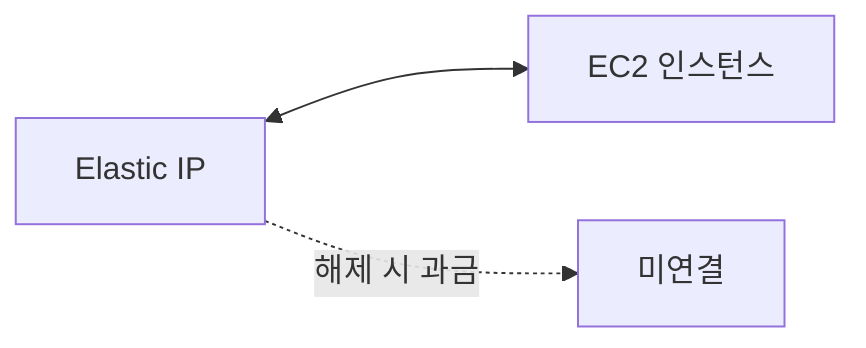

# Elastic IP (EIP)

**퍼블릭 IP를 고정**해서 인스턴스 재시작·교체 후에도 **같은 주소**를 유지하게 하는 AWS 리소스입니다.  
인스턴스에 붙였다가 해제하면 그때부터 **과금**되므로, 사용 중일 때만 붙여 두는 것이 좋습니다.

---

## 1. 특징

- **고정 퍼블릭 IP**: 인스턴스 중지·재시작해도 유지(일반 퍼블릭 IP는 바뀔 수 있음)
- **인스턴스에 연결**: 한 번에 한 인스턴스에만 연결, 옮기려면 해제 후 다른 인스턴스에 연결
- **미사용 시 과금**: 인스턴스에 붙어 있지 않은 EIP는 시간당 요금 발생

---

## 2. 용도

- 고정 IP가 필요한 서비스(예: 화이트리스트 등록)
- NAT Gateway의 퍼블릭 IP로도 사용(관리형)
- 장애 시 같은 IP로 다른 인스턴스에 재연결

---

## 요약

| 항목 | 설명 |
|------|------|
| EIP | 퍼블릭 IP 고정 리소스 |
| 연결 | EC2(또는 NAT GW) 1대당 1개 |
| 비용 | 미연결 상태로 두면 과금 |
