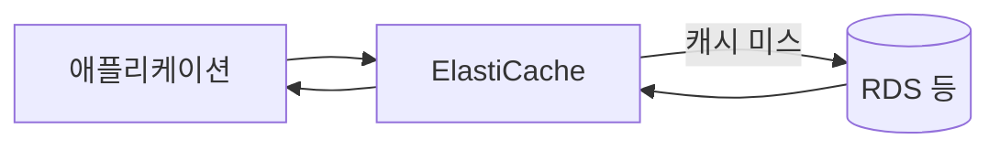

# ElastiCache 기본 (Redis vs Memcached)

**관리형 인메모리 캐시** 서비스입니다.  
**Redis**와 **Memcached** 엔진 중 하나를 골라, DB·API 앞단에 캐시 계층을 두어 응답 속도·DB 부하를 줄일 때 씁니다.

---

## 1. Redis

- **키·값 + 다양한 자료구조**(리스트, 셋, 정렬 셋, Pub/Sub 등)
- **클러스터·복제** 지원, persistence 옵션
- 세션·캐시·실시간 순위·Pub/Sub에 적합

---

## 2. Memcached

- **단순 키·값** 캐시, 다중 노드 수평 확장
- 복제·persistence 없음, 구조 단순·저지연
- 단순 캐시·세션 스토어에 적합

---

---

## 3. 비교

| 구분 | Redis | Memcached |
|------|-------|-----------|
| 데이터 구조 | 키·값 + 리스트·셋·Pub/Sub 등 | 키·값만 |
| 복제·Persistence | 지원(옵션) | 없음 |
| 용도 | 세션·캐시·실시간·Pub/Sub | 단순 캐시 |

---

## 요약

| 항목 | 설명 |
|------|------|
| ElastiCache | 관리형 인메모리 캐시(Redis 또는 Memcached) |
| Redis | 기능 풍부·복제·persistence |
| Memcached | 단순·저지연·수평 확장 |
