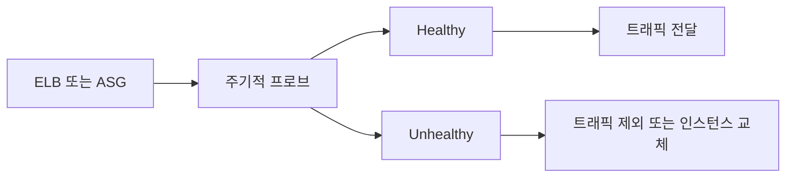

# Health Check (ELB/ASG)

**대상이 정상인지** 주기적으로 프로브하여, Unhealthy면 **트래픽 제외(ELB)** 또는 **인스턴스 교체(ASG)** 하게 하는 동작입니다.

---

## 1. ELB 헬스 체크

- **타깃 그룹**에 등록된 대상에 주기적으로 요청
- 성공(2xx 등)이면 Healthy, 실패면 Unhealthy → 트래픽 제외
- 경로·포트·간격 설정 가능

---

## 2. ASG 헬스 체크

- EC2 상태 체크 + ELB 헬스 체크(선택) 반영
- Unhealthy 인스턴스는 교체 대상

---

---

## 요약

| 구분 | ELB | ASG |
|------|-----|-----|
| Unhealthy 시 | 해당 타깃에 트래픽 제외 | 인스턴스 제거 후 필요 시 교체 |
| 설정 | 타깃 그룹 단위 경로·포트·간격 | EC2 상태 + ELB 헬스(선택) |
