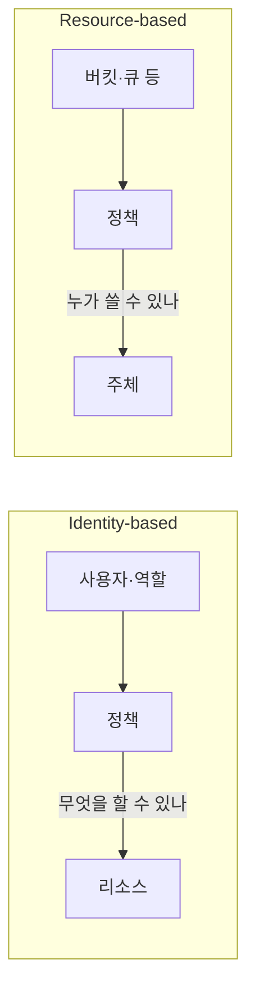

# Identity-based vs Resource-based (IAM 정책)

IAM 정책은 **주체(사용자·역할)**에 붙는지, **리소스(버킷·큐 등)**에 붙는지로 나뉩니다.  
"이 주체가 무엇을 할 수 있나?"는 Identity-based, "누가 이 리소스를 쓸 수 있나?"는 Resource-based로 정의합니다.

---

## 1. Identity-based Policy

- **주체(사용자·역할·그룹)** 에 연결
- 해당 주체가 **어떤 리소스에 어떤 액션**을 할 수 있는지 정의
- 예: IAM 역할 정책, 사용자 인라인 정책

---

## 2. Resource-based Policy

- **리소스**에 연결 (S3 버킷, SQS 큐, Lambda 등)
- **누가** 이 리소스에 접근할 수 있는지 정의
- 예: S3 버킷 정책, SQS 큐 정책

---

---

## 요약

| 구분 | Identity-based | Resource-based |
|------|----------------|----------------|
| 연결 대상 | 주체(역할·사용자) | 리소스(버킷·큐 등) |
| 질문 | "이 주체가 무엇을 할 수 있나?" | "누가 이 리소스를 쓸 수 있나?" |
