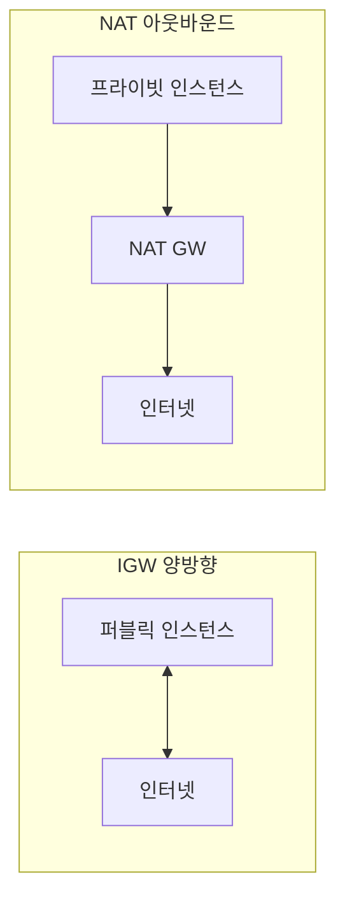

# IGW vs NAT Gateway

**인터넷과 VPC를 잇는** 두 가지 AWS 구성 요소입니다. 퍼블릭 서브넷은 IGW(양방향), 프라이빗 서브넷의 아웃바운드는 NAT Gateway로 나갑니다.

---

## 1. IGW (Internet Gateway)

- VPC와 **인터넷** 간 1:1 연결
- **퍼블릭 IP**를 가진 인스턴스가 인터넷과 양방향 통신
- 퍼블릭 서브넷의 라우팅 테이블에 `0.0.0.0/0 → igw-xxx` 경로

---

## 2. NAT Gateway

- **아웃바운드 전용**: 프라이빗 서브넷에서 인터넷으로 나갈 때만 사용
- 프라이빗 서브넷 라우팅에 `0.0.0.0/0 → nat-xxx` 설정
- 인터넷에서 프라이빗 인스턴스로 **들어오는** 경로는 제공하지 않음

---

## 요약

| 구분 | IGW | NAT Gateway |
|------|-----|-------------|
| 방향 | 양방향(퍼블릭 IP) | 아웃바운드 주로 |
| 용도 | 퍼블릭 서브넷 | 프라이빗 서브넷의 아웃바운드 |
