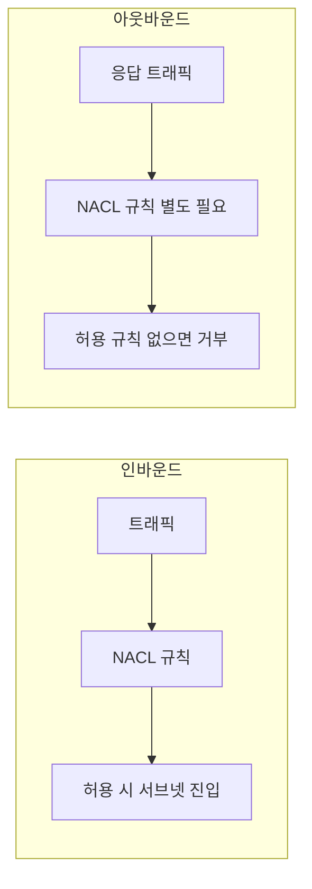

# NACL (stateless)

**서브넷 단위**의 **상태 비유지(Stateless)** 방화벽입니다.  
인바운드만 허용해도 **응답 아웃바운드는 별도 규칙**으로 허용해야 하며, Allow·Deny 규칙 모두 사용 가능합니다.

---

## 1. 특징

- **서브넷**에 연결, 서브넷 경계에서 트래픽 필터링
- **Stateless**: 인바운드 허용해도 응답 아웃바운드는 별도 규칙으로 허용해야 함
- **Allow + Deny** 규칙 모두 사용 가능, 번호 순서로 평가

---

## 2. 동작

- 규칙 번호가 작은 것부터 적용, 첫 매칭 시 적용 후 종료
- 기본 NACL은 모든 트래픽 허용, 커스텀 NACL은 기본 거부 후 허용 규칙 추가

Stateless: 인바운드 허용만으로는 응답 아웃바운드가 자동 허용되지 않음.

---

## 요약

| 구분 | NACL | Security Group |
|------|------|----------------|
| 단위 | 서브넷 | ENI(인스턴스) |
| 상태 | Stateless | Stateful |
| 거부 규칙 | 있음 | 없음(Allow만) |
