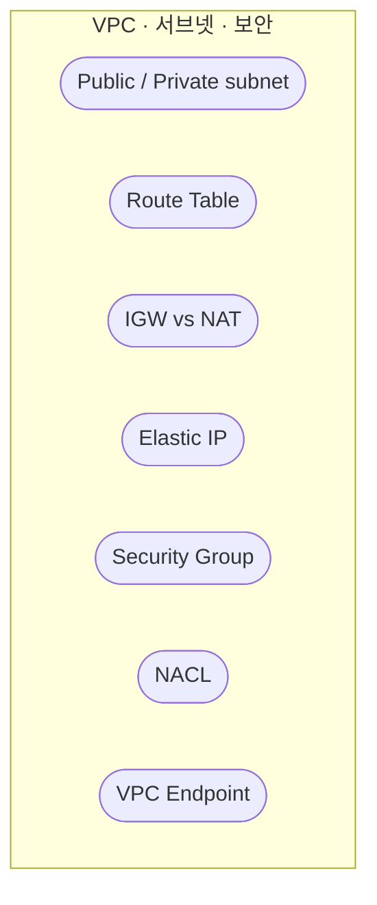
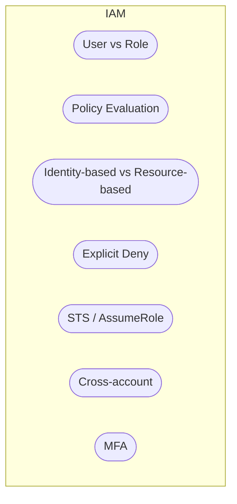
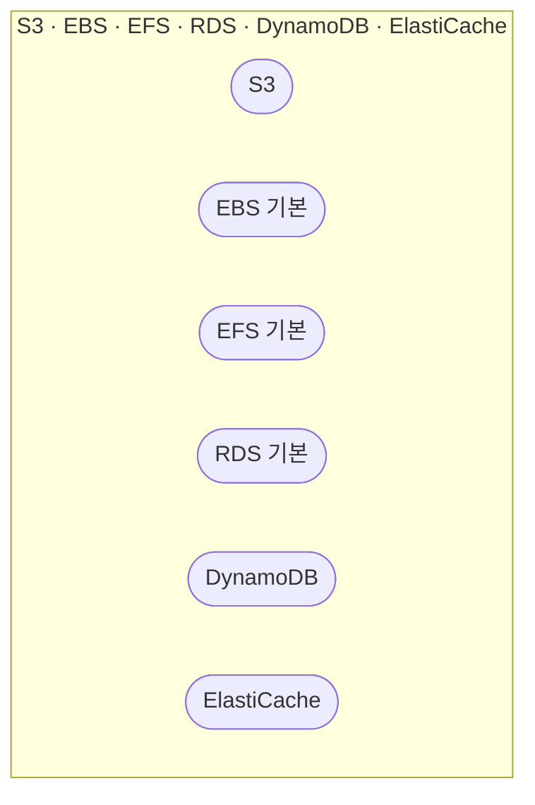
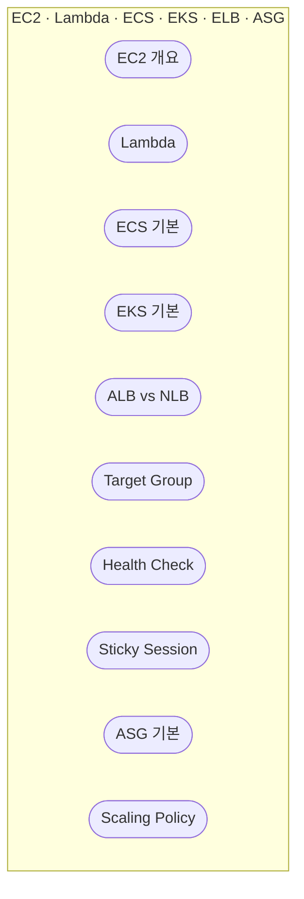
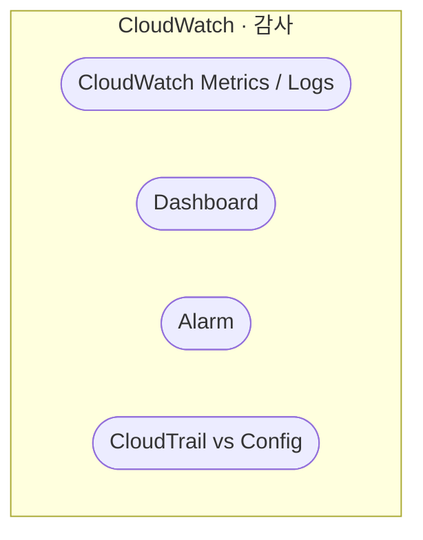

---

## 1. Networking (VPC · 서브넷 · 보안)

---

## 2. Identity & Access (IAM)

---

## 3. Storage & Data (S3 · EBS · EFS · RDS · DynamoDB · ElastiCache)

---

## 4. Compute & Scaling (EC2 · Lambda · ECS · EKS · ELB · ASG)

---

## 5. Monitoring & Logging (CloudWatch · 감사)

---

세부 설명은 각 대분류 아래 개념 문서에서 이어서 읽을 수 있습니다.
