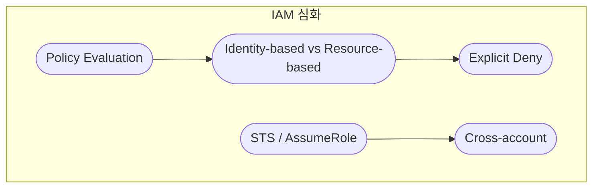
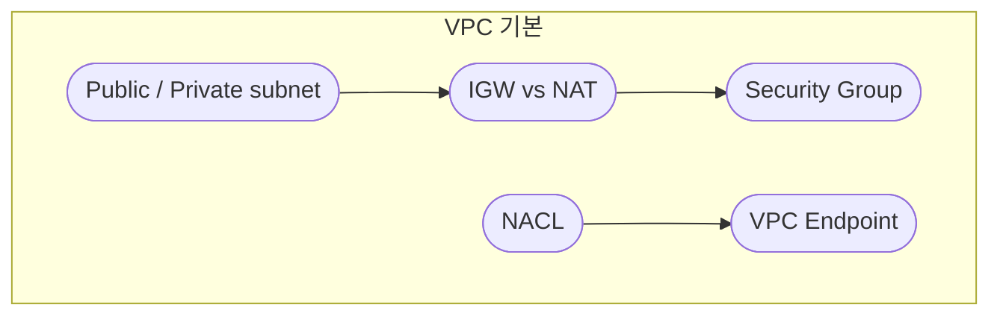
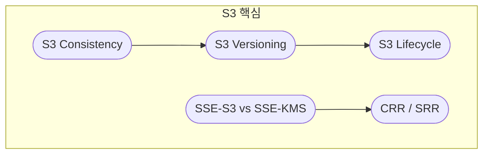
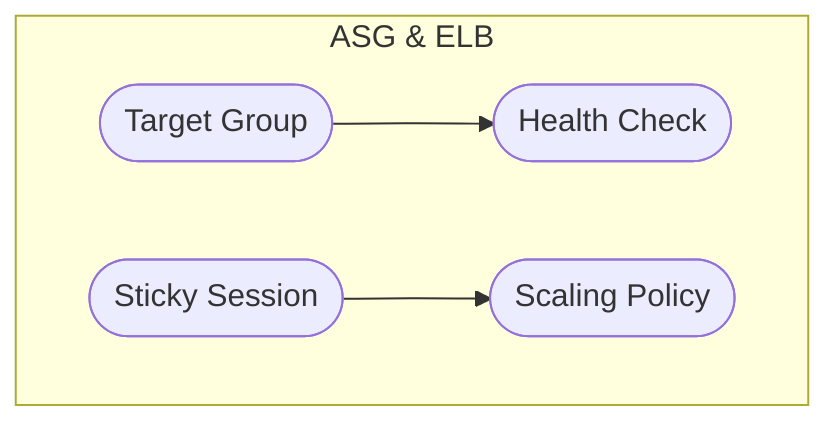
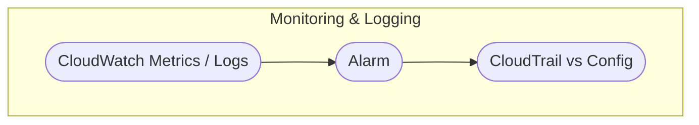

# 2. AWS 공통 · 개요

시험 공통 기반 서비스 사고와 의사결정 프레임을 한눈에 볼 수 있습니다.  
노드를 클릭하면 해당 개념 문서로 이동합니다.

---

## IAM 심화

---

## VPC 기본 구조

---

## S3 핵심

---

## Auto Scaling & ELB

---

## Monitoring & Logging

---

세부 설명은 각 개념 문서에서 이어서 읽을 수 있습니다.
