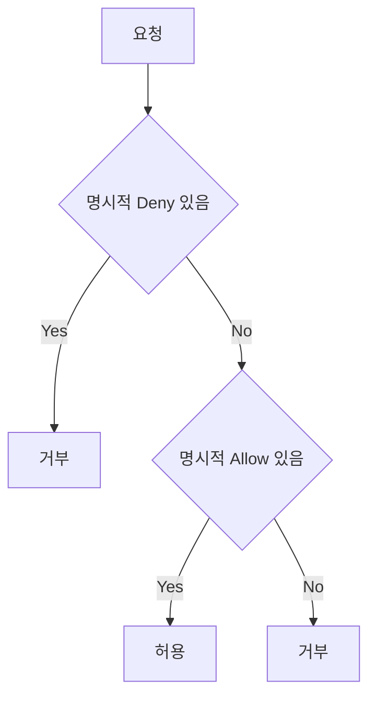

# Policy Evaluation Logic (IAM)

**요청** → **명시적 Deny 있으면 거부** → 없으면 **명시적 Allow 있으면 허용** → 둘 다 없으면 **거부**.  
IAM에서 권한 허용/거부는 이 **정책 평가 로직**에 따라 결정됩니다.

---

## 1. 평가 순서

1. **기본적으로 거부** (Deny by default)
2. **명시적 Deny**가 있으면 → **거부**
3. **명시적 Allow**가 있으면 → **허용**
4. Allow/Deny 모두 없으면 → **거부**

---

## 2. 핵심 원칙

- **Explicit Deny 우선**: 어떤 정책에서든 `"Effect": "Deny"`가 있으면 해당 액션은 거부됩니다.
- **Identity-based + Resource-based** 정책이 모두 적용되며, 둘 중 하나라도 Deny면 거부입니다.

---

## 3. AWS 공통 연결

- **IAM 정책**, **S3 버킷 정책**, **SQS 큐 정책** 등에서 동일한 평가 로직이 사용됩니다.

---

## 요약

| 순서 | 조건 | 결과 |
|------|------|------|
| 1 | 명시적 Deny 있음 | 거부 |
| 2 | 명시적 Deny 없음 + Allow 있음 | 허용 |
| 3 | 둘 다 없음 | 거부(Deny by default) |
