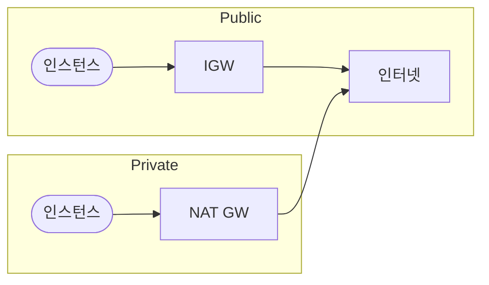

# Public / Private subnet 정의

VPC 내 서브넷은 **인터넷과의 연결 방식**으로 퍼블릭/프라이빗으로 구분합니다. 퍼블릭은 IGW로 직접 통신, 프라이빗은 NAT 등을 통해서만 아웃바운드 가능합니다.

---

## 1. Public subnet

- **퍼블릭 IP**를 가진 리소스가 인터넷과 직접 통신 가능
- 라우팅 테이블에 **IGW(Internet Gateway)** 로 가는 경로가 있음
- 웹 서버 등 “밖에서 접속받는” 리소스 배치

## 2. Private subnet

- **IGW로 가는 기본 경로가 없음** (또는 IGW 경로를 두지 않음)
- 인터넷 나가는 트래픽은 **NAT Gateway** 등 경유
- DB, 앱 서버 등 “밖에 직접 노출하지 않는” 리소스 배치

---

## 요약

| 구분 | Public | Private |
|------|--------|---------|
| IGW 경로 | 있음 | 없음(또는 NAT 경유) |
| 용도 | 인터넷 직접 통신 | 내부·NAT 통신 |
| 배치 예 | 웹 서버, 로드밸런서 | DB, 앱 서버 |
