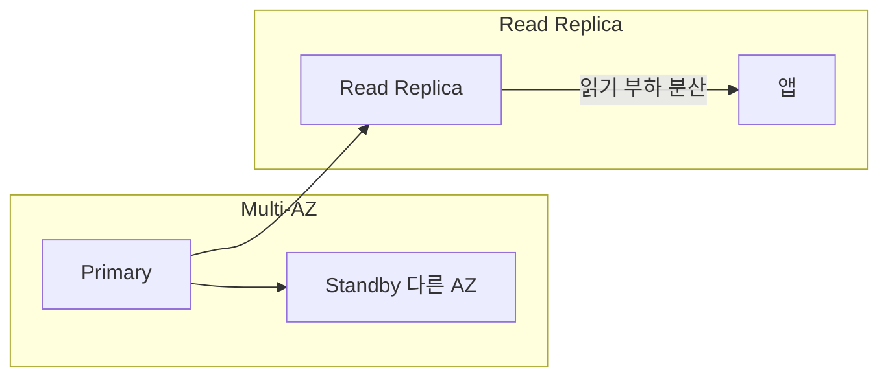

# RDS 기본 (Relational Database Service)

**관리형 관계형 DB** 서비스입니다.  
엔진(MySQL, PostgreSQL, MariaDB, Oracle, SQL Server)·사이즈를 선택하면 **패치·백업·Multi-AZ** 등 운영을 AWS가 맡아 줍니다.

---

## 1. 특징

- **엔진**: MySQL, PostgreSQL, MariaDB, Oracle, SQL Server
- **인스턴스·스토리지**: 인스턴스 타입·EBS 볼륨으로 용량·성능 설정
- **Multi-AZ**: 대기 인스턴스를 다른 AZ에 두어 장애 시 자동 페일오버
- **Read Replica**: 읽기 부하 분산용 복제본(비동기)

---

| 엔진 | 비고 |
|------|------|
| MySQL, PostgreSQL, MariaDB | 오픈소스, 많이 사용 |
| Oracle, SQL Server | 라이선스 포함 옵션 |

## 2. 용도

- OLTP·웹 앱 DB를 직접 EC2에 올리지 않고 관리형으로 운영
- 백업·스냅샷·패치를 서비스로 제공받을 때

---

## 요약

| 항목 | 설명 |
|------|------|
| RDS | 관리형 관계형 DB(MySQL, PostgreSQL 등) |
| Multi-AZ | 다른 AZ 대기 인스턴스, 장애 시 페일오버 |
| Read Replica | 읽기 전용 복제본, 부하 분산 |
