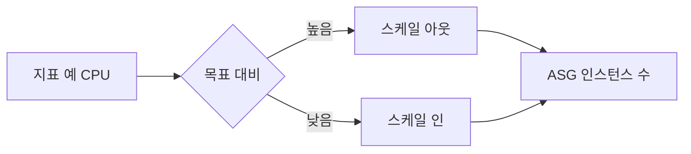

# Scaling Policy (Target tracking)

**목표 지표**(예: CPU 70%)를 설정하면, ASG가 **그 수준에 맞게 인스턴스 수**를 자동으로 늘리거나 줄이는 정책입니다.

---

## 1. Target tracking

- **목표 지표**(예: CPU 70%, 요청 수 1000/분)를 설정
- 현재 값이 목표보다 높으면 스케일 아웃, 낮으면 스케일 인
- 단순 설정으로 자동 조정

---

## 2. 기타

- Step scaling: 임계값·단계별 조정량 설정
- Scheduled: 시간대별 용량 예약

---

## 요약

| 유형 | 설명 |
|------|------|
| Target tracking | 목표 지표(예: CPU 70%) 유지하도록 인스턴스 수 자동 조정 |
| Step scaling | 임계값·단계별 조정량 설정 |
| Scheduled | 시간대별 용량 예약 |
