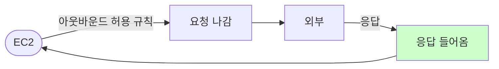

# Security Group (stateful)

**허용 규칙만** 지정하면, 해당 방향의 **응답 트래픽은 자동 허용**되는 인스턴스·ENI 단위 방화벽입니다.  
AWS에서 EC2 등에 붙이는 **상태 유지(Stateful)** 보안 단위입니다.

---

## 1. 특징

- **Allow 규칙만** 지정 (거부 규칙 없음, 명시하지 않으면 거부)
- **Stateful**: 아웃바운드 허용 시 해당 응답 트래픽은 자동 허용
- **ENI(인스턴스)** 에 연결, 서브넷이 아닌 인스턴스 단위

Stateful: 아웃바운드 허용 시 응답 인바운드는 별도 규칙 없이 자동 허용.

---

## 2. 동작

- 인바운드·아웃바운드 각각 규칙으로 허용할 포트/프로토콜/소스 지정
- 여러 SG를 한 ENI에 붙일 수 있음, 규칙은 합쳐서 적용

---

## 요약

| 항목 | 설명 |
|------|------|
| 단위 | ENI(인스턴스) 단위 |
| 규칙 | Allow만, 거부 규칙 없음(명시 안 하면 거부) |
| 상태 | Stateful, 응답 트래픽 자동 허용 |
| NACL과 차이 | NACL은 서브넷·Stateless·Deny 규칙 있음 |
