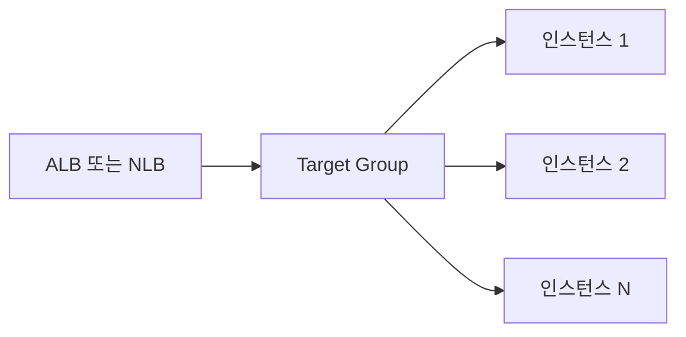

# Target Group 개념

ALB·NLB가 **트래픽을 보낼 대상을 묶는 단위**입니다.  
타깃 그룹에 인스턴스·IP·Lambda를 등록하고, 헬스 체크·라우팅을 이 단위로 설정합니다.

---

## 1. 역할

- ALB/NLB가 **타깃 그룹** 단위로 라우팅
- 타깃 그룹에 **인스턴스·IP·Lambda** 등을 등록
- 헬스 체크는 타깃 그룹 단위로 설정

---

## 2. 유형

- **Instance**: EC2 등
- **IP**: 고정 IP
- **Lambda**: Lambda 함수(ALB만)

---

## 요약

| 항목 | 설명 |
|------|------|
| 정의 | ALB·NLB가 트래픽을 보낼 대상을 묶는 단위 |
| 등록 대상 | 인스턴스·IP·Lambda(ALB만) |
| 설정 | 헬스 체크·라우팅을 타깃 그룹 단위로 적용 |
