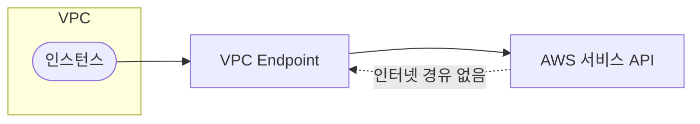

# VPC Endpoint

**VPC 안에서** 인터넷·NAT 없이 **AWS 서비스(S3, DynamoDB, EC2 API 등)**에 접근하게 하는 구성입니다.  
보안·비용·지연 측면에서 프라이빗 액세스가 필요할 때 사용합니다.

---

## 1. 유형

- **Gateway Endpoint**: S3, DynamoDB 등. 라우팅 테이블에 경로 추가.
- **Interface Endpoint**: 그 외 대부분 서비스(EC2 API, SQS, SNS 등). ENI 형태, PrivateLink.

---

## 2. 효과

- 퍼블릭 인터넷·NAT를 타지 않아 **지연·비용·보안** 측면에서 유리
- VPC 내부 트래픽만 사용

---

## 요약

| 구분 | Gateway Endpoint | Interface Endpoint |
|------|------------------|---------------------|
| 대상 | S3, DynamoDB | EC2 API, SQS, SNS 등 대부분 |
| 구현 | 라우팅 테이블에 경로 | ENI, PrivateLink |
| 효과 | 인터넷·NAT 미경유, 지연·비용·보안 유리 |
