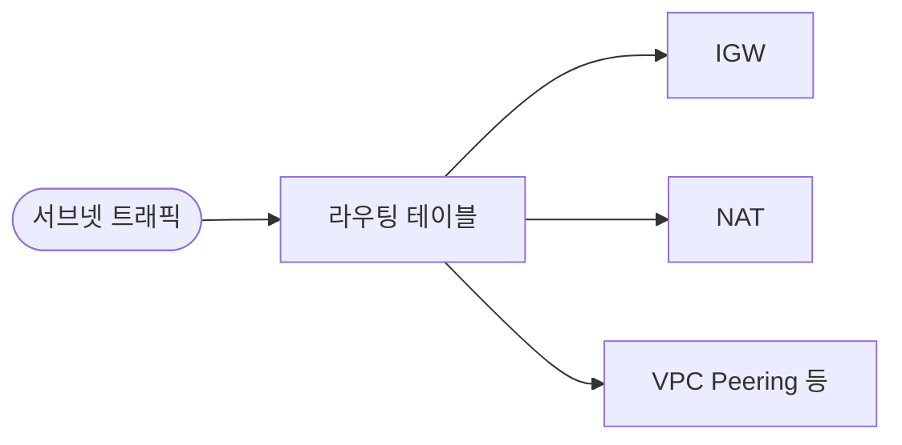

# VPC Route Table

**서브넷에 붙어** 트래픽이 **어느 경로(대상)**로 나갈지 결정하는 테이블입니다. 각 서브넷은 하나의 라우팅 테이블에 연결되며, `0.0.0.0/0 → IGW` 또는 `→ NAT` 등으로 인터넷 경로를 지정합니다.

---

## 1. 동작

- **라우팅 테이블**에 “대상 CIDR → 타깃(IGW, NAT, ENI 등)” 규칙을 정의
- 서브넷을 라우팅 테이블에 **연결(association)** 하면, 해당 서브넷 트래픽에 적용
- **로컬 경로**: VPC 내부 CIDR은 자동 포함, 다른 서브넷 등으로 라우팅

---

## 2. 용도

- 퍼블릭 서브넷: `0.0.0.0/0 → igw-xxx` 로 IGW 경로 추가
- 프라이빗 서브넷: `0.0.0.0/0 → nat-xxx` 로 NAT Gateway 경로 추가
- 서브넷별로 다른 테이블을 붙여 경로를 분리 가능

---

## 요약

| 항목 | 설명 |
|------|------|
| 단위 | VPC당·서브넷당 연결 |
| 규칙 | 대상 CIDR → 타깃(IGW, NAT, VPC Peering 등) |
| 메인 | 서브넷 생성 시 기본 연결되는 메인 라우팅 테이블 |
