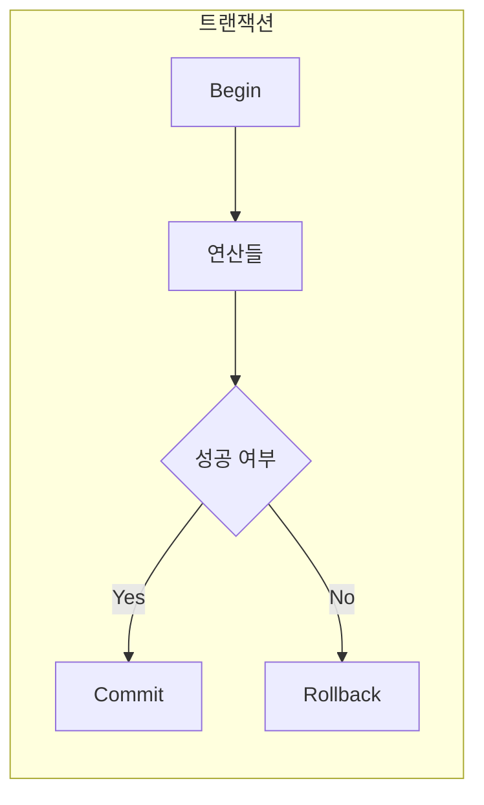

# ACID · 트랜잭션 · 락

데이터 일관성과 동시 제어의 직관을 정리합니다.

## ACID (한 줄씩 + 예시)

| 속성 | 의미 | 예시 |
|------|------|------|
| **A**tomicity | 전부 성공 또는 전부 롤백 | A계정에서 B계정으로 이체: "A 차감"과 "B 증가" 둘 다 성공하거나, 둘 다 취소. 중간에 하나만 반영되는 상태는 없음. |
| **C**onsistency | 제약 조건을 만족하는 상태만 허용 | "잔액 ≥ 0", "외래키 존재" 같은 제약. 커밋 후 DB는 항상 이 조건을 만족. |
| **I**solation | 동시 트랜잭션 간 간섭 제어 | 트랜잭션 A가 읽는 동안 B가 같은 행을 덮어쓰지 않게 막거나, 읽기 수준을 나눠서 "더러운 읽기" 등을 방지. |
| **D**urability | 커밋된 결과는 장애 후에도 유지 | 커밋 직후 전원이 나가도, 재시작 후에는 커밋한 잔액·주문이 그대로 남아 있음. |

## 트랜잭션

- 여러 연산을 **한 단위**로 묶어, 모두 성공 시에만 반영하는 방식.
- RDBMS의 기본 실행 단위.

## 락 (Lock)

- 동시에 같은 자원을 수정하지 않도록 **직렬화**하는 수단.
- 행 락, 테이블 락, 낙관적 락 등. 데드락 가능성은 설계 시 고려.

## 분산 환경에서는?

여러 DB·서비스에 걸치면 **분산 트랜잭션**(2PC, Saga)과 **분산 락**(Redis 등)이 필요합니다.  
→ [분산 트랜잭션 · 분산 락](/handbook/core-cs/distributed-transaction-lock)에서 정리합니다.

## 개념 도식

