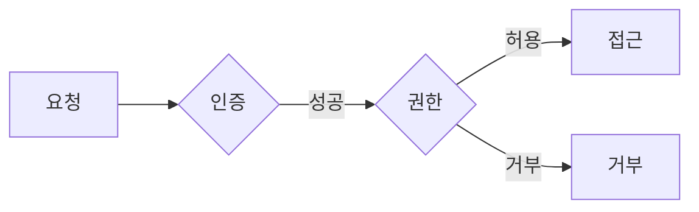

# Authentication vs Authorization

**누구인지**와 **무엇을 허용할지**를 구분하는 개념입니다.

## Authentication (인증)

- **신원 확인**: “당신이 누구인가?”
- 로그인(아이디·비밀번호, MFA, 토큰 등)으로 주체를 식별

## Authorization (권한 부여)

- **허용 범위**: “이 주체가 무엇을 할 수 있는가?”
- 역할·정책에 따라 리소스 접근·동작 허용/거부

## 요약

| 구분 | Authentication | Authorization |
|------|----------------|---------------|
| 질문 | 누구인가? | 무엇을 할 수 있는가? |
| 순서 | 먼저 수행 | 인증 후 수행 |
