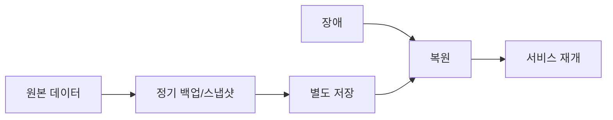

# 백업 (Backup)

**정기 스냅샷·백업**으로 데이터를 별도 저장해 두고, 장애 시 **해당 시점으로 복원**하는 복구 수단입니다. RPO를 확보하는 기본 방법입니다.

데이터 손실을 허용 범위 안으로 줄이기 위해 시점별 복사본을 유지합니다.

## 정의

- **백업**: 데이터의 **일시점 복사본**을 다른 저장소·미디어에 보관
- **스냅샷**: 특정 시점의 디스크·볼륨 상태를 저장 (증분·전체 방식 등)
- **복원**: 장애 후 백업/스냅샷에서 데이터를 되살려 서비스 재개

## RPO와의 관계

- **RPO**(복구 시점 목표)가 짧을수록 **백업/스냅샷 주기**를 짧게 가져가야 함
- 예: RPO 1시간 → 최소 1시간 이내 주기로 백업 또는 스냅샷
- 백업만으로는 **RTO**(복구 시간)가 길어질 수 있음 → 복제·DR 전략과 조합

## 개념 도식

## 요약

| 항목 | 내용 |
|------|------|
| 목적 | 데이터 손실 범위 제한, RPO 확보 |
| 수단 | 정기 스냅샷, 전체/증분 백업, 오프사이트 보관 |
| 한계 | 복원에 시간 소요 → RTO가 김. 복제·DR 전략과 함께 설계 |
