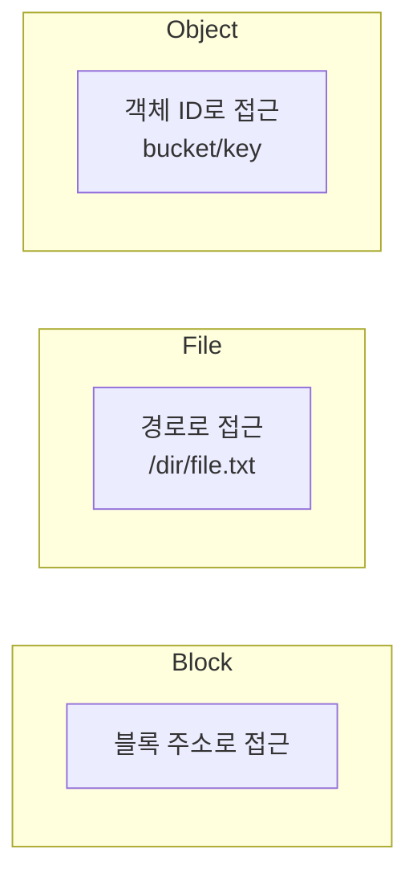

# Block vs File vs Object

저장 유형의 세 가지 기본 모델입니다.

## 한눈에 비교

| 구분 | Block | File | Object |
|------|--------|--------|--------|
| **단위** | 고정 크기 블록 | 파일·디렉터리 | 객체(데이터+메타+ID) |
| **접근** | 블록 주소(offset) | 경로(이름) | ID·HTTP API |
| **구조** | OS가 FS로 구성 | 계층(폴더/파일) | 평평한 네임스페이스 |
| **특징** | 낮은 지연, 고 IOPS | 공유·락·메타데이터 | 스케일 아웃, eventually consistent |
| **예** | EBS, 로컬 디스크 | EFS, FSx, NFS | S3 |

## Block Storage

- **단위**: 고정 크기 블록. 주소로 직접 접근.
- **특징**: 낮은 지연, 고 IOPS. OS가 블록을 파일 시스템으로 구성.

## File Storage

- **단위**: 파일·디렉터리 계층. 경로(파일 이름)로 접근.
- **특징**: 공유·락·메타데이터. NFS, SMB.

## Object Storage

- **단위**: 객체(데이터 + 메타데이터 + 고유 ID). HTTP 등으로 접근.
- **특징**: 평평한 네임스페이스, 스케일 아웃, eventually consistent 등.

## 개념 도식

선택 시 **지연·처리량·공유·일관성·비용** 요구사항을 기준으로 삼으면 됩니다.
