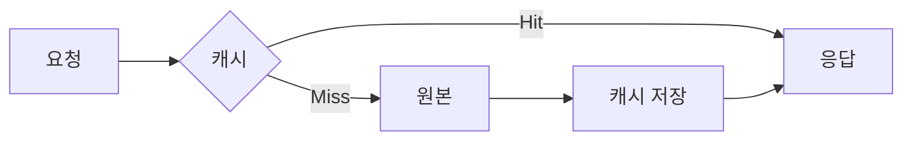

# 캐시 원리

**자주 쓰는 데이터를 빠른 저장소에 두어** 응답 속도와 원본 부하를 줄이는 것입니다.

## 목적

- **지연 감소**: 원본(DB, API)보다 가까운·빠른 저장소에서 응답
- **원본 부하 감소**: 반복 요청을 캐시에서 처리해 DB·API 부하 완화

## 동작

- **캐시 히트**: 요청한 데이터가 캐시에 있음 → 캐시에서 바로 반환
- **캐시 미스**: 없음 → 원본에서 조회 후 캐시에 저장하고 반환

## 고려사항

- **일관성**: 원본이 바뀌면 캐시도 갱신·무효화 필요 (TTL, 이벤트 기반 무효화 등)
- **전략**: Cache-aside(앱이 캐시 읽기·쓰기), Write-through(쓰기 시 캐시·원본 동시 갱신) 등

## 개념 도식

## 실제 예시

| 상황 | 동작 |
|------|------|
| Hit | 상품 정보 요청 → 캐시에 있음 → 캐시에서 반환 (DB 미조회) |
| Miss | 첫 요청 또는 TTL 만료 → DB 조회 → 캐시에 저장 후 반환 |

## 요약

- **빠른 저장소에 복사본**을 두어 응답 속도↑, 원본 부하↓
- **히트/미스** 구분, **무효화·일관성** 설계가 핵심
