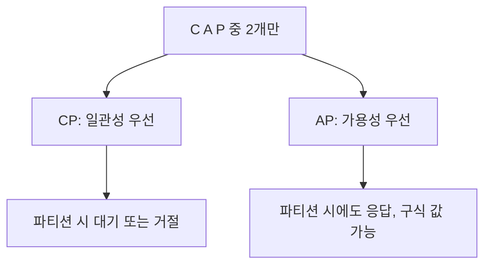

# CAP Theorem

**P는 실전에서 필수** → **CP**(일관성 우선, 파티션 시 대기·거절) 또는 **AP**(가용성 우선, 파티션 시에도 응답) 중 하나 선택.

분산 시스템에서 C, A, P를 동시에 만족할 수 없다는 정리입니다.

## 세 가지 속성

- **C (Consistency)**: 모든 노드가 **같은 시점에 같은 데이터**를 봄. 쓰기 직후 읽으면 어디서든 최신 값.
- **A (Availability)**: 모든 요청에 **항상 응답**함. 거절·타임아웃 없이 응답 반환.
- **P (Partition tolerance)**: **네트워크 분할**(일부 노드 간 통신 끊김)이 나도 시스템이 동작함.

## 정리

- 실제 네트워크에서는 **파티션(P)** 을 완전히 막을 수 없음 → P는 전제.
- 따라서 **CP** 또는 **AP** 중 하나를 선택하게 됨.
  - **CP**: 파티션 시 일관성을 지키기 위해 응답을 거절·대기할 수 있음 (가용성 희생).
  - **AP**: 파티션 시에도 응답은 하되, 일시적으로 오래된 값이 보일 수 있음 (일관성 희생).

## 실제 예시

| 선택 | 예시 | 이유 |
|------|------|------|
| **CP** | 분산 DB(강한 일관성 모드), 락 서비스 | 금융·재고처럼 “잘못된 값보다는 못 주는 게 나을 때” 일관성 우선. |
| **AP** | 캐시, DNS, 일부 NoSQL | “항상 응답은 해주고, 잠깐 오래된 값이면 수용”할 때 가용성 우선. |

## 요약

- **P**는 실전에서 필수 → **C vs A** 트레이드오프.
- DB·캐시·메시징 선택 시 “일관성 우선(CP)” vs “가용성 우선(AP)” 설계의 근거.
