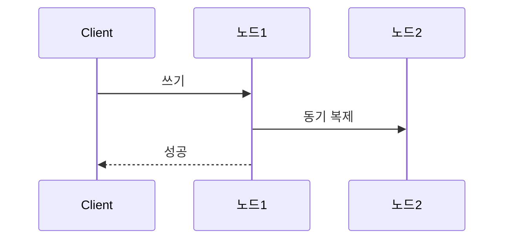
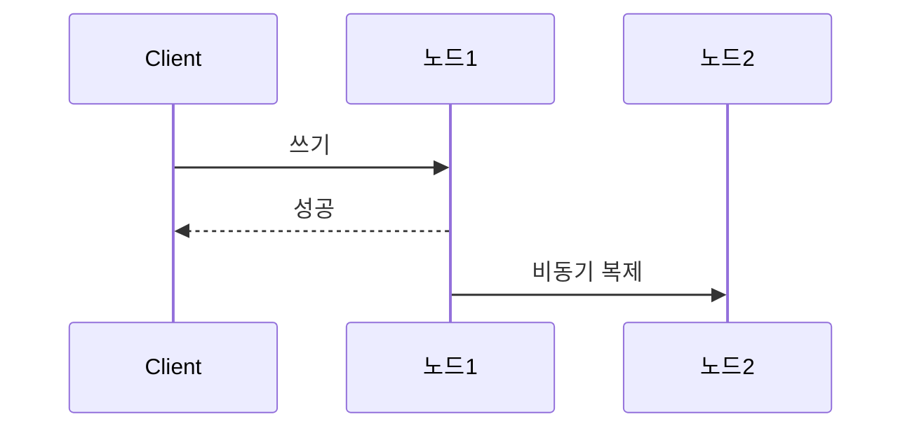

# Consistency Model (Strong / Eventual)

**Strong**: 쓰기 → 동기 복제 후 응답 → 어디서 읽어도 최신.  
**Eventual**: 쓰기 → 즉시 응답 → 비동기 복제 후 수렴.

여러 노드가 같은 데이터를 **언제 같은 값으로 보는지**에 대한 모델입니다.

## Strong Consistency (강한 일관성)

- **쓰기 직후** 어떤 노드에서 읽어도 **항상 최신 값**이 보임
- 모든 노드가 같은 순서로 갱신을 적용한 것처럼 동작 (동기 복제 또는 합의 후 응답)
- 비용: 쓰기 지연·가용성 트레이드오프(네트워크 분할 시 대기 가능)

## Eventual Consistency (최종 일관성)

- 쓰기 후 **어느 구간까지는** 이전 값이 보일 수 있음
- **복제가 전파되면** 결국 모든 노드가 같은 값으로 수렴
- 비용: 읽기 시 구식 값 가능. 장점: 쓰기 지연 작음, 가용성·확장성에 유리

## 개념 도식

**Strong**: 쓰기 후 N1·N2 모두 최신 반영한 뒤 응답. 이후 어디서 읽어도 최신.

**Eventual**: 쓰기 후 N2는 당장 구식일 수 있음. 비동기 복제 후 수렴.

## 실제 예시

| 구분 | 예시 | 이유 |
|------|------|------|
| **Strong** | 잔액 조회, 재고 차감 | “한 번 읽은 값이 곧바로 최신”이어야 함. 잘못된 잔액·재고는 허용하기 어려움. |
| **Eventual** | 좋아요 수, 조회수, 타임라인 | “잠깐 숫자가 어긋나도 괜찮고, 곧 맞춰지면 됨”일 때. 읽기 부하 분산·쓰기 속도 우선. |

## 요약

| 구분 | Strong | Eventual |
|------|--------|----------|
| 읽기 시점 | 항상 최신 | 전파 후 최신 |
| 쓰기 후 | 즉시 모든 노드 반영 | 전파까지 지연 가능 |
| 용도 | 금융·재고 등 | 조회 부하 분산·소셜 피드 등 |
