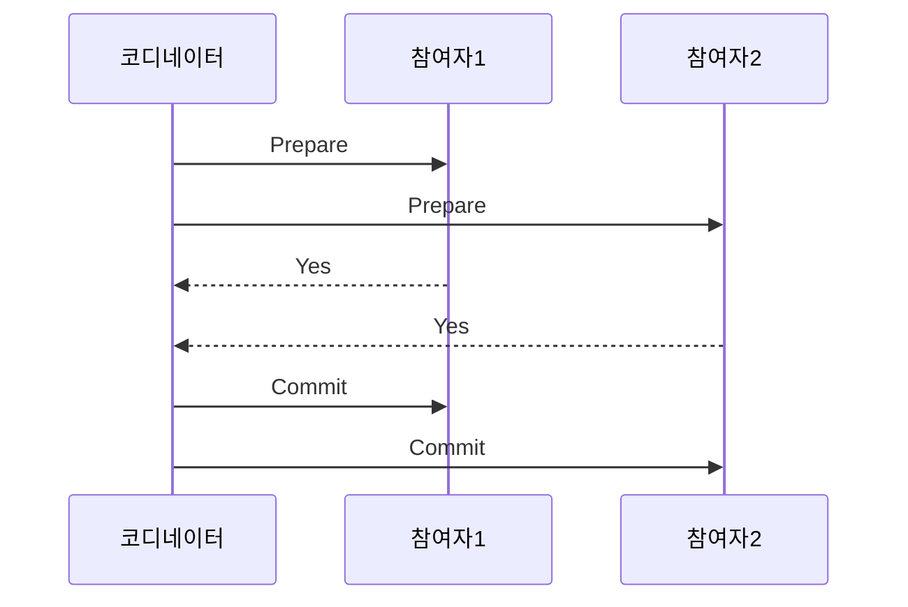
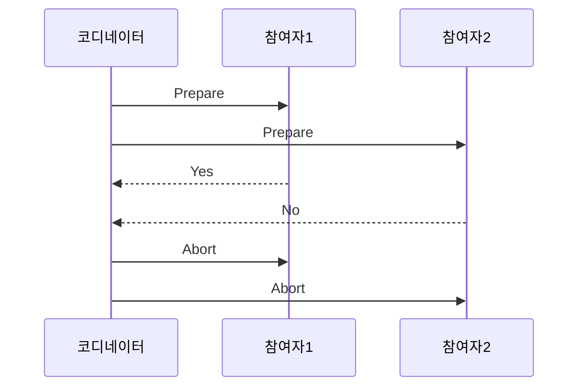
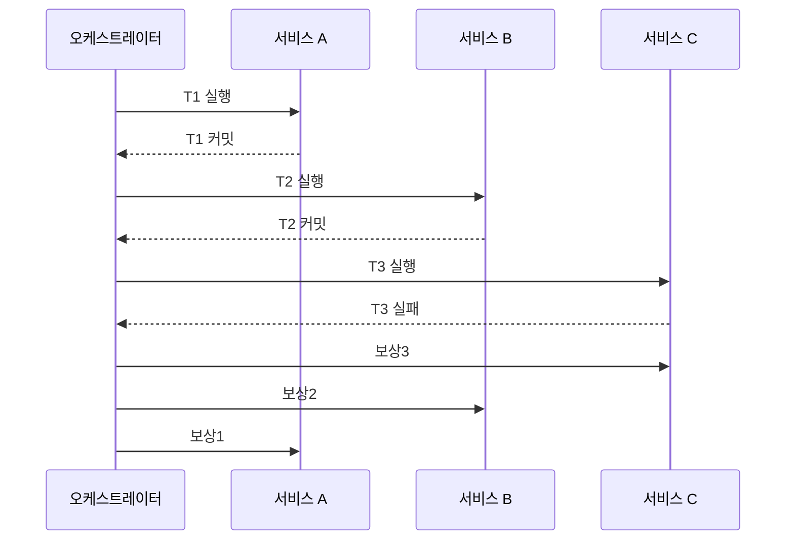
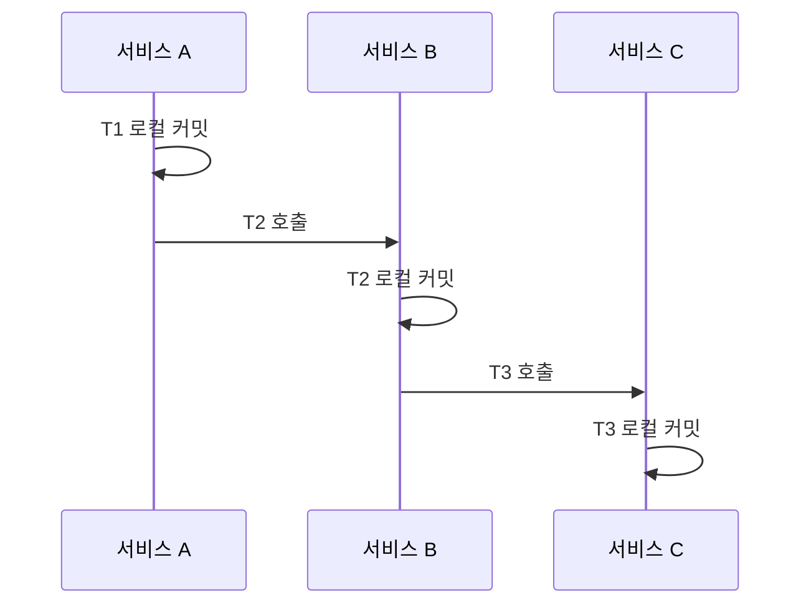
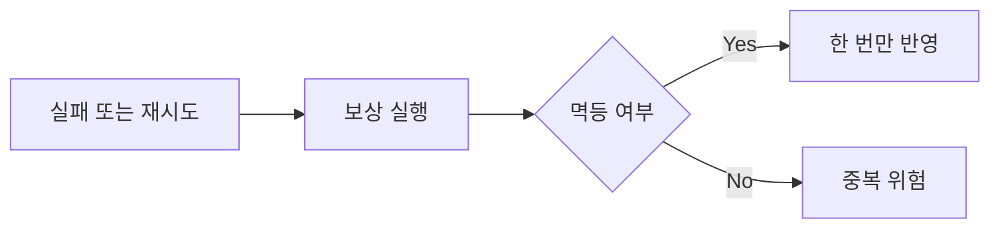
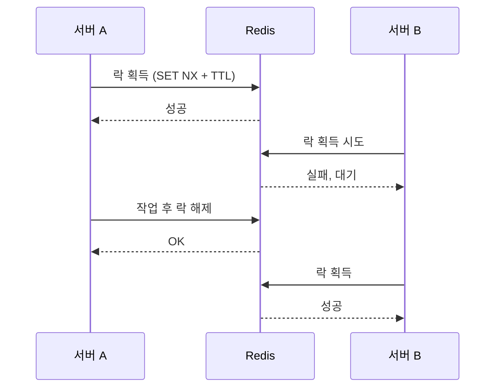
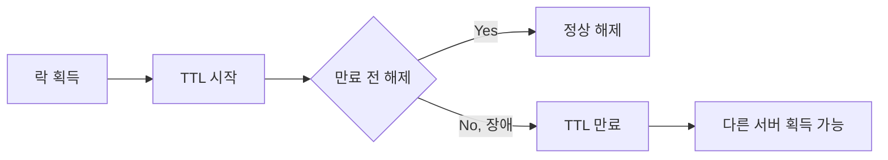

# 분산 트랜잭션 · 분산 락

여러 서비스·DB에 걸친 트랜잭션과 락을 **명확한 흐름**으로 정리합니다.

---

## 분산 트랜잭션

여러 노드에 **전부 성공 or 전부 롤백**을 맞추려면 단일 DB 트랜잭션만으로는 부족합니다.

### 2PC (Two-Phase Commit)

**1단계 Prepare** → 모두 "가능" → **2단계 Commit**. 하나라도 No면 Abort.

하나라도 No면: 코디네이터가 Abort 전달 → 참여자 전부 Rollback.

**결과**: 전부 반영 or 전부 미반영 (원자성).  
**단점**: Prepare~Commit 대기 구간에 참여자가 자원 점유. 코디네이터 장애 시 Commit/Abort 불명확 → 참여자 블로킹.

---

### Saga (사가)

**T1 로컬 커밋** → **T2 로컬 커밋** → **T3 로컬 커밋**. T3 실패 시 **보상3** → **보상2** → **보상1** 역순.

**정상 흐름** (블로킹 없음 — 각 서비스가 로컬만 커밋하므로 Prepare 대기 없음)

**단점**: 중간에 "T1만 반영" "T1+T2 반영" 같은 불일치 구간이 잠깐 보일 수 있음 → 보상 끝나면 최종 일관.

**보상·멱등성**: 실패/재시도 → 보상 실행 → 멱등이면 한 번만 반영, 아니면 중복 위험. 보상 로직을 멱등하게 설계해야 함.

---

### 2PC vs Saga

| 항목 | 2PC | Saga |
|------|-----|------|
| 흐름 | Prepare → 모두 Yes → Commit / 하나라도 No → Abort | T1→T2→T3 / 실패 시 보상3→2→1 |
| 일관성 | 한 시점에 전부 or 전부 안 됨 | 최종 수렴, 중간 불일치 구간 있음 |
| 블로킹 | Prepare~Commit 대기 | 거의 없음 |
| 장애 | 코디네이터·참여자 복구 필요 | 보상·재시도로 정합성 |

---

## 분산 락 (Distributed Lock)

**한 시점에 한 주체만** 특정 자원을 쓰게 하는 메커니즘.

**A 락 획득** → 작업 → **락 해제**. B는 그동안 대기 후 해제 시점에 획득.

**TTL(리스)**: 락 획득 → TTL 시작 → 만료 전 해제면 정상, 장애 등으로 만료되면 다른 서버가 획득 가능.

| 구분 | 내용 |
|------|------|
| 목적 | 한 시점에 한 주체만 자원 사용 |
| 구현 | Redis SET NX + TTL, ZooKeeper 등 |
| 주의 | 해제 시 소유자 검증, 타임아웃·재시도 상한 |

---

## 관련 개념

- **ACID · 트랜잭션 · 락**: 단일 DB 직관 → [문서](/handbook/core-cs/acid-transaction-lock)
- **Idempotency**: Saga 보상·재시도 시 멱등 설계
- **Consistency models**: Strong vs Eventual 선택과 연결
