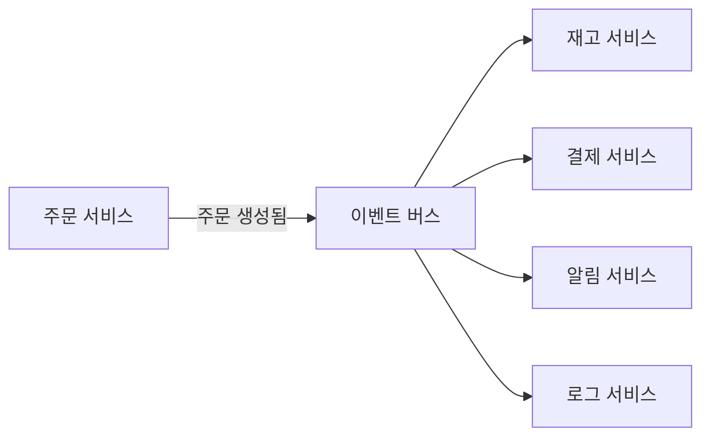

# Event-driven Architecture

**발행자** → 이벤트 발행 → **이벤트 버스** → 구독자들(재고·결제·알림·로그 등)이 각자 비동기 처리.

상태 변화를 **이벤트로 발행**하고, **구독자가 비동기로 반응**하는 구조입니다.

## 핵심

- **이벤트**: “무엇이 **일어났다**”는 사실만 전달 (과거형). “주문 생성해줘”가 아니라 “주문이 생성됨”.
- **발행자**: 이벤트를 한 번 발행하면, 구독자 목록을 알 필요 없음
- **구독자**: 관심 이벤트를 구독해, 받은 뒤 후속 처리(재고 차감·알림·로그 등). 비동기 처리 가능

## 특징

- **결합도 감소**: 발행자는 “누가 쓰는지” 몰라도 됨. 구독자 추가·제거가 발행자 코드 변경 없이 가능
- **비동기**: 발행 후 곧바로 응답 가능. 무거운 처리는 구독자가 나중에 수행
- **확장**: 새 기능 = 새 구독자 추가. 기존 발행·다른 구독자에 영향 최소화

## 개념 도식

- 한 이벤트를 **여러 서비스**가 각자 구독해 처리. 주문 서비스는 “누가 구독하는지” 몰라도 됨.

## 실제 예시

| 단계 | 예시 |
|------|------|
| 이벤트 | “주문이 생성됨” (주문 ID, 상품, 수량 등) |
| 구독자 1 | 재고 서비스 → 재고 차감 |
| 구독자 2 | 결제 서비스 → 결제 요청 |
| 구독자 3 | 알림 서비스 → 이메일·SMS |
| 구독자 4 | 로그·분석 서비스 → 저장 |

- 주문 서비스는 이벤트만 발행하고 끝. 각 구독자가 **독립적으로** 처리. 한 구독자 장애가 다른 구독자로 전파되지 않도록 설계 가능.

## 주의·연관 개념

- **멱등성**: 같은 이벤트가 재전달될 수 있으므로, 구독자 처리 시 멱등하게 설계하는 것이 안전함.
- **전달 수단**: 이벤트 버스·메시징은 보통 **Pub/Sub** 또는 **Queue**로 구현됨.

## 요약

- 이벤트(무엇이 일어났다)를 중심으로 **발행-구독** 구조를 쓰는 아키텍처.
- 결합도 감소·비동기·확장에 유리. 큐·Pub/Sub이 이벤트 전달 수단으로 쓰임.
