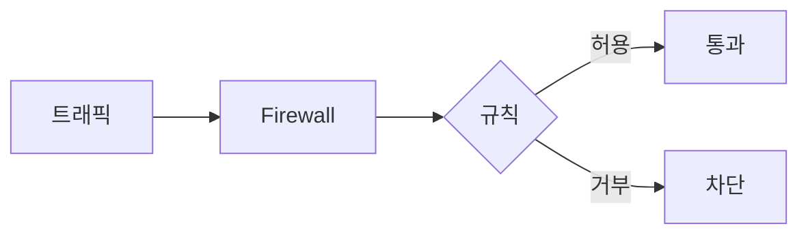

# Firewall · Network security (인바운드/아웃바운드)

**네트워크 경계에서 트래픽을 허용/차단**하는 장치·기능입니다.

## 인바운드 vs 아웃바운드

| 방향 | 의미 | 예시 규칙 |
|------|------|-----------|
| **인바운드** | 외부 → 내부로 **들어오는** 트래픽 | "80 포트만 허용", "이 IP 대역만 허용" |
| **아웃바운드** | 내부 → 외부로 **나가는** 트래픽 | "HTTPS(443)만 허용", "특정 API로만 허용" |

방화벽은 **방향별로** 규칙을 둘 수 있음. 인바운드는 "누가 들어오게 할지", 아웃바운드는 "어디로 나가게 할지" 제어.

## 역할

- **정책에 따라** 패킷·연결을 허용 또는 거부
- 기준: IP, 포트, 프로토콜, **방향(인바운드/아웃바운드)** 등

## 동작 방식

- **Stateless**: 패킷 단위로 규칙 적용 (연결 상태 미고려)
- **Stateful**: 연결 상태를 보고 허용/차단 (예: 응답 트래픽 자동 허용)

## 요약

- **인바운드**: 들어오는 트래픽 제어. **아웃바운드**: 나가는 트래픽 제어.
- Stateless / Stateful 구분은 “연결 상태를 보는지” 여부
