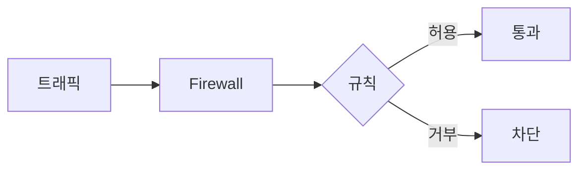

# Firewall 개념

**네트워크 경계에서 트래픽을 허용/차단**하는 장치·기능입니다.

## 역할

- **정책에 따라** 패킷·연결을 허용 또는 거부
- 기준: IP, 포트, 프로토콜, 방향 등

## 동작 방식

- **Stateless**: 패킷 단위로 규칙 적용 (연결 상태 미고려)
- **Stateful**: 연결 상태를 보고 허용/차단 (예: 응답 트래픽 자동 허용)

## 요약

- 경계에서 **트래픽 필터링**: 허용/차단
- Stateless / Stateful 구분은 “연결 상태를 보는지” 여부
