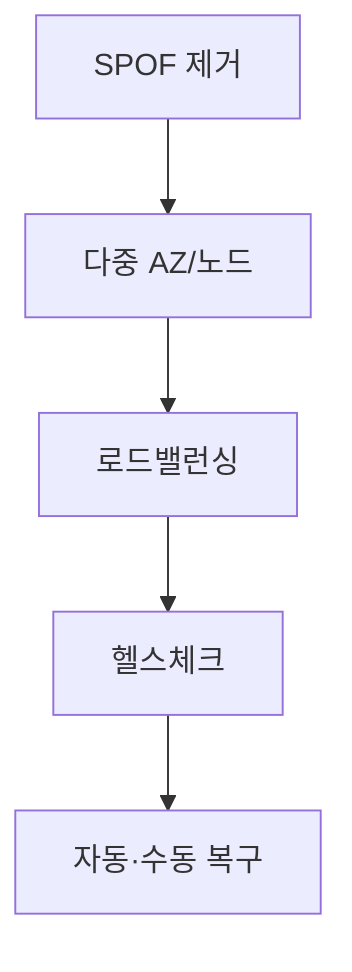

# HA 설계 원칙

**고가용성(High Availability)** 을 위한 기본 설계 방향입니다.

## 단일 장애점 제거 (SPOF 제거)

- **한 구성요소**가 죽으면 전체가 멈추지 않도록 **중복·다중화**
- 서버, 네트워크, 스토리지, DB 등 모든 계층에 적용

## 다중화·분산

- **여러 AZ/리전**: 한 구역 장애가 나도 다른 구역으로 트래픽 전환
- **로드 밸런싱**: 트래픽 분산 + 장애 인스턴스 자동 제외

## 장애 감지·복구

- **헬스체크·모니터링**으로 장애를 빨리 감지
- **자동 복구**: 재시작, 트래픽 제거(Unhealthy 제외) 또는 **수동 절차**(RTO에 맞춰 준비)

## 개념 도식

## 실제 예시

| 원칙 | 예시 |
|------|------|
| SPOF 제거 | DB 단일 대기 → Primary + Standby, 웹 서버 1대 → N대 |
| 다중화 | 여러 가용 영역에 인스턴스 분산 배치 |
| 장애 감지·복구 | ALB 헬스체크 실패 시 해당 인스턴스로 트래픽 중단, ASG로 교체 |

## 요약

- **SPOF 제거** → **다중화(AZ·노드)** → **로드밸런싱** → **헬스체크·복구**가 HA의 기본 뼈대
