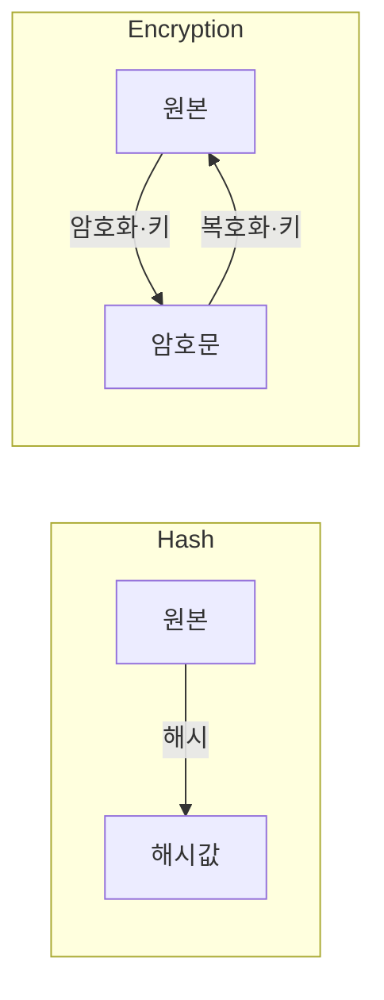
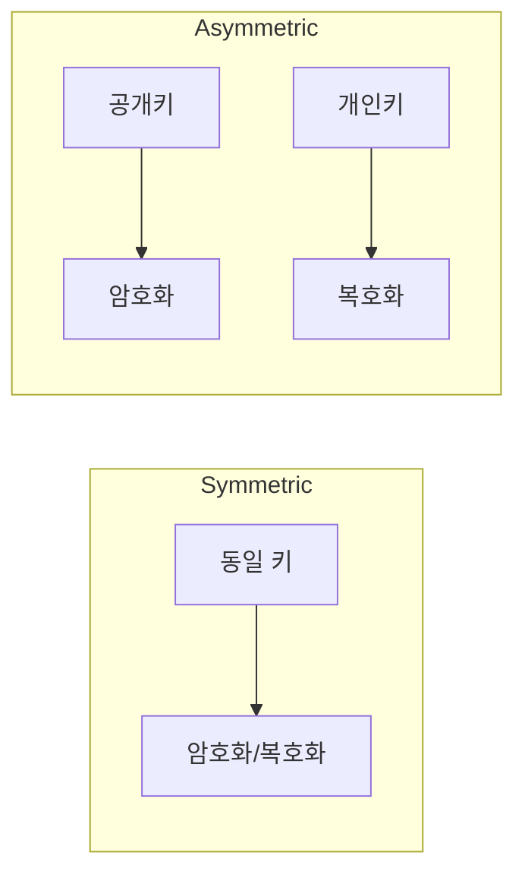

# Hash vs Encryption

**원본 복구 가능 여부**로 구분합니다.  
해시(Hash)는 **암호화가 아님** — 단방향·역산 불가. 암호화(Encryption)는 **키로 양방향** 변환.

## Hash (해시)

- **단방향**: 원본 → 고정 길이 값, **역산 불가**
- 같은 입력 → 같은 해시 (결정적)
- 용도: 비밀번호 저장, 무결성 검증(체크섬)

## Encryption (암호화)

- **양방향**: 키로 암호화·복호화, **원본 복구 가능**
- 용도: 기밀 유지(저장·전송 데이터 보호)

Hash는 한 방향만, Encryption은 키로 양방향.

### 암호화 방식: Symmetric vs Asymmetric

- **Symmetric (대칭)**: **같은 키**로 암호화·복호화. 연산 가벼움, 키 교환·관리가 과제.
- **Asymmetric (비대칭)**: **공개키**로 암호화, **개인키**로 복호화 (또는 반대). 키 배포는 쉬움, 연산은 상대적으로 무거움.

## 요약

| 구분 | Hash | Encryption |
|------|------|------------|
| 방향 | 단방향 | 양방향 |
| 원본 복구 | 불가 | 가능(키 필요) |

| 구분 | Symmetric | Asymmetric |
|------|-----------|------------|
| 키 | 1개 | 2개(쌍) |
| 용도 예 | 대용량 데이터 암호화 | 키 교환·전자서명 |
