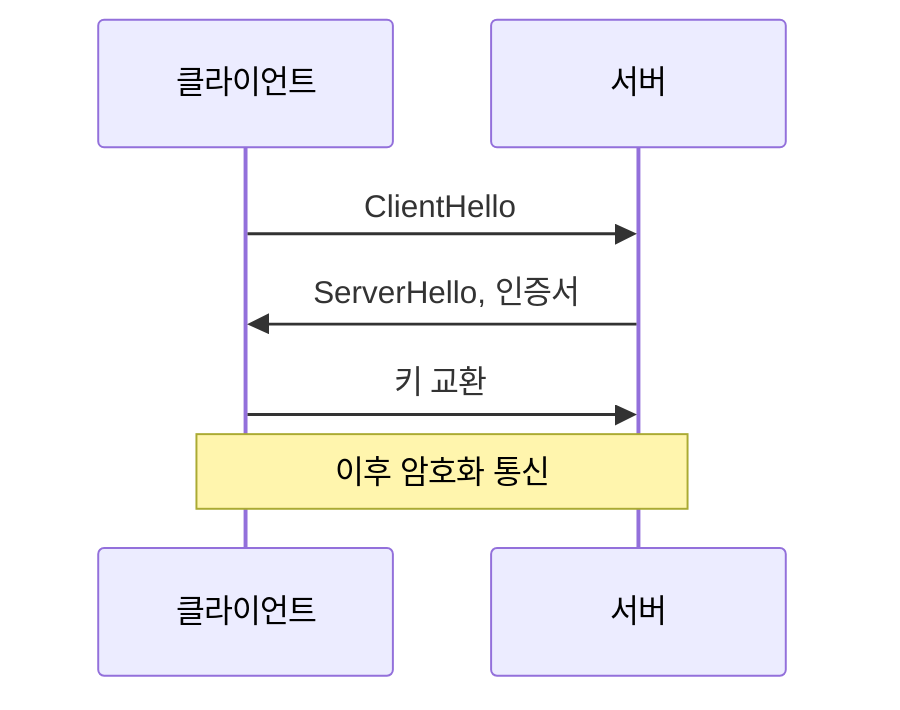

# HTTP / HTTPS / TLS handshake

**애플리케이션 프로토콜(HTTP)**과 **암호화 계층(TLS)**만 구분해서 정리합니다.

## HTTP

- **평문** 요청/응답
- 요청 메서드(GET, POST 등), 경로, 헤더, 본문으로 통신

## HTTPS

- HTTP 위에 **TLS**를 씌운 것
- 전송 구간이 암호화되어 도청·변조를 막음

## TLS handshake

- HTTPS 연결 시 **맨 처음** 진행하는 협상 단계
- 목적: 암호 스위트·키 교환 등 합의 후, 이후 트래픽을 암호화

## 요약

- **HTTP**: 평문 프로토콜
- **HTTPS**: HTTP + TLS
- **TLS handshake**: HTTPS 연결 수립 시 한 번 수행되는 협상·키 설정
