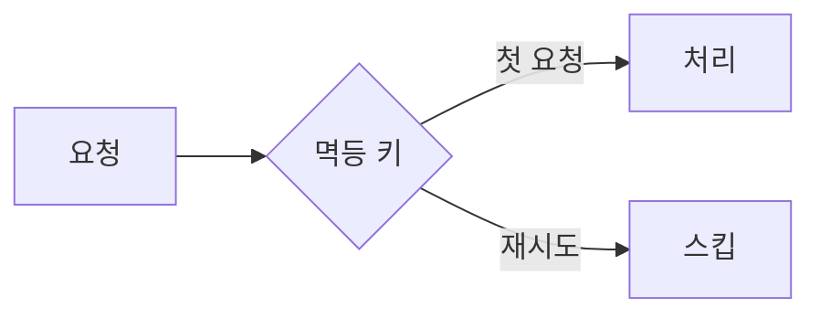
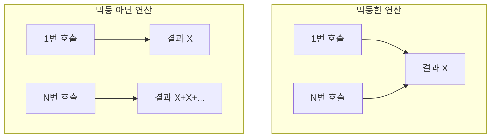

# Idempotency (멱등성)

**같은 요청을 여러 번 해도 결과가 한 번 한 것과 같다**는 성질입니다.  
Idempotency = **멱등성**.

## 정의

- 연산 f에 대해 `f(x) = f(f(x))` → 여러 번 적용해도 한 번 적용한 것과 동일
- 네트워크·재시도 환경에서 “한 번만 처리”할 때 필요한 개념

## 멱등 O vs 멱등 X

| 구분 | 예시 | 여러 번 호출 시 |
|------|------|-----------------|
| **멱등** | GET 조회, “이름을 김철수로 설정” | 결과 동일 (조회는 같은 응답, 설정은 같은 상태) |
| **멱등 아님** | “잔액 1만 원 차감”, “주문 1건 생성” | 호출할 때마다 차감·생성 반복 → 이중 차감·중복 주문 |

## 왜 중요한가

- 클라이언트 재시도, 타임아웃 후 재전송 시 **중복 처리** 방지
- 결제·차감·생성 같은 연산에서 멱등하지 않으면 재시도 시 이중 차감·이중 생성 발생

## 구현 관점

- **멱등 키**: 요청마다 고유 ID를 두고, 같은 ID면 한 번만 처리
- **멱등 연산 설계**: “설정값으로 덮어쓰기”처럼 여러 번 호출해도 결과가 같게 설계

## 요약

- 같은 요청을 여러 번 받아도 **한 번만 반영**되게 하는 것 = 멱등성
- 재시도·분산 환경에서 필수 설계 요소
