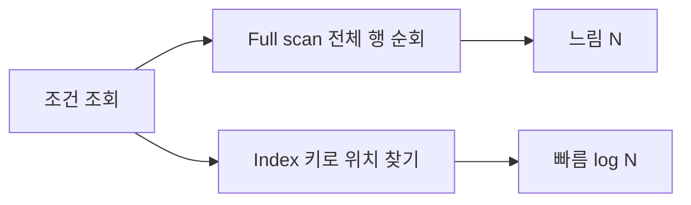

# Index가 왜 빠른가

인덱스는 "어디에 있는지"를 빠르게 찾게 해줍니다.

## 직관

- 테이블 전체를 스캔하지 않고, **정렬·구조화된 보조 자료구조**에서 조건에 맞는 위치를 찾음.
- B-tree 등으로 키 기준 검색이 O(log N) 수준으로 줄어듦.

## Full scan vs Index

## 트레이드오프

| 구분 | 효과 |
|------|------|
| **읽기** | 조건 검색·정렬 구간 조회가 빨라짐 |
| **쓰기** | 인덱스도 갱신해야 해서 부담이 늘어남 |
| **저장** | 인덱스만큼 공간이 추가로 필요 |
