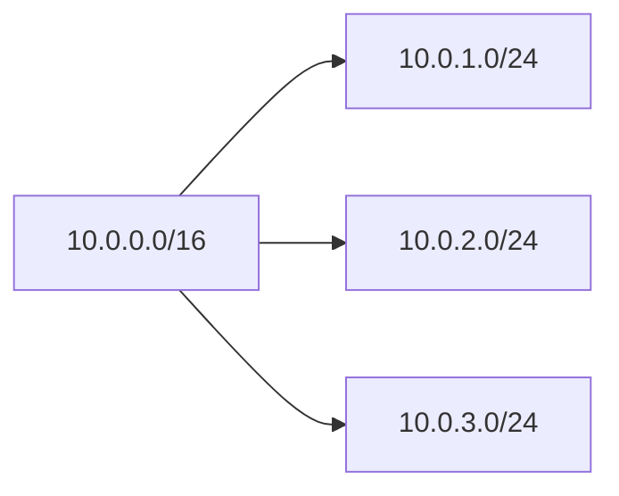

# IP / CIDR / Subnetting

주소 체계와 구간 나누기의 기초 개념만 정리합니다.

## IP 주소 (IPv4)

- 32비트, 8비트씩 10진수 표기 (예: `192.168.1.1`)
- **네트워크 부분** + **호스트 부분** 구분

## IP 주소 (IPv6)

- 128비트, 16비트씩 16진수 8블록 표기 (예: `2001:0db8::1`)
- 연속 0은 `::`로 한 번만 축약 가능
- 네트워크/호스트 구분은 IPv4와 동일하게 **프리픽스 길이**로 표현 (예: `/64`)
- 주소 공간이 커서 공인 주소 부족 문제 완화

## CIDR

- **접두사 표기**: `IP/프리픽스 길이`
- 예: `10.0.0.0/16` → 앞 16비트 네트워크, 뒤 16비트 호스트
- 프리픽스가 클수록 호스트 수 감소

## 서브넷팅

- 하나의 큰 네트워크를 **서브넷**으로 나누어 구간별로 관리
- 같은 CIDR 규칙으로 서브넷 범위를 정의

| 프리픽스 | 호스트 수(대략) |
|----------|-----------------|
| /24      | 254             |
| /25      | 126             |
| /26      | 62              |
| /28      | 14              |
