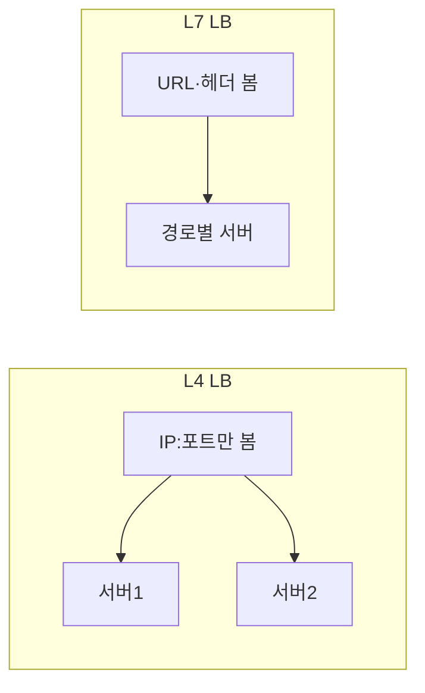

# L4 vs L7 Load Balancer

로드밸런서가 **어느 계층 정보**를 보고 트래픽을 나누는지만 구분합니다.  
L4 = 전송 계층(IP·포트), L7 = 애플리케이션 계층(HTTP 등).

## L4 (Layer 4)

- **IP + 포트**만 보고 분산
- TCP/UDP 헤더까지만 사용 → 패킷 payload는 보지 않음
- 장점: 빠르고 단순, 애플리케이션에 비침투

## L7 (Layer 7)

- **애플리케이션 계층** 정보로 분산: URL, 호스트, 헤더, 쿠키 등
- 경로별·호스트별 라우팅, 스티키 세션, SSL 종료 등에 적합

## 요약

| 구분 | L4 | L7 |
|------|----|----|
| 보는 정보 | IP, 포트 | URL, 헤더 등 |
| payload 참조 | 없음 | 있음 |
| 용도 | 단순 분산 | 경로·세션·SSL 종료 등 |
