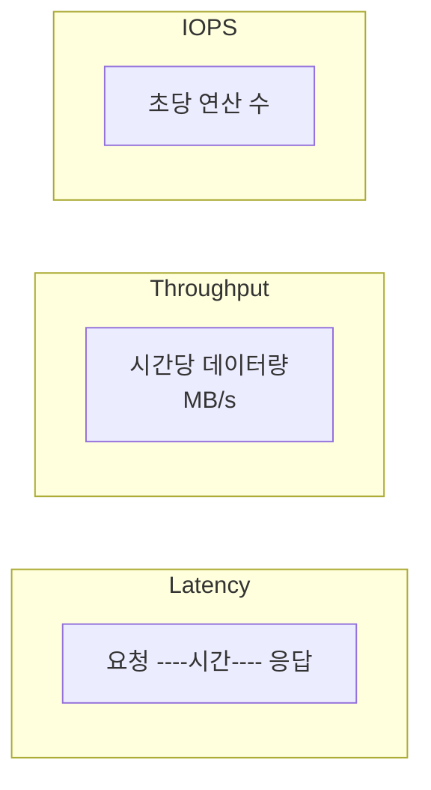

# Latency / Throughput / IOPS

저장·네트워크 성능을 논할 때 쓰는 기본 지표입니다.

## 정의

| 지표 | 의미 | 단위 | 언제 중요한가 |
|------|------|------|----------------|
| **Latency** | 요청 → 응답까지 **시간** | ms | 반응 속도(클릭~화면), DB 쿼리 응답 |
| **Throughput** | 단위 시간당 **데이터량** | MB/s, Gbps | 대용량 복사, 스트리밍, 순차 읽기/쓰기 |
| **IOPS** | 초당 **I/O 연산 횟수** | ops/s | 랜덤 읽기/쓰기, 트랜잭션, 작은 블록 다수 |

## 개념 도식

