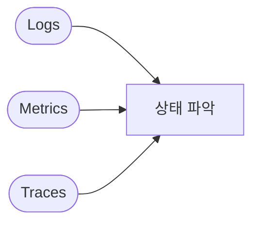

# Observability (Logs / Metrics / Traces)

**Logs**(무슨 일이) · **Metrics**(얼마나) · **Traces**(어디서 느려) → 세 가지로 상태 파악.

시스템이 **어떻게 동작하는지** 파악하기 위한 데이터 유형입니다.

## Logs (로그)

- **이벤트·메시지** 기록: "언제, 무엇이, 어디서" 일어났는지
- 텍스트·구조화 로그, 레벨(debug, info, error) 등
- 용도: 장애 원인 추적, 감사, 디버깅

## Metrics (메트릭)

- **숫자 지표**: CPU, 메모리, 요청 수, 지연 시간, 에러율 등
- **시계열**로 수집·집계·시각화·알람에 사용
- 용도: 성능 모니터링, 용량 계획, SLO 측정

## Traces (트레이스)

- **요청이 지나간 경로**: 서비스 A → B → C, 구간별 소요 시간
- 분산 환경에서 **병목·실패 구간** 파악에 사용
- 용도: 지연 원인 분석, 의존성 파악

## 개념 도식

## 실제 예시

| 유형 | 예시 |
|------|------|
| Logs | "2024-01-15 10:00:00 ERROR [order-service] 결제 타임아웃 orderId=123" |
| Metrics | CPU 80%, 요청/초 1000, p99 지연 200ms |
| Traces | 요청 ID abc → API Gateway 5ms → Order 50ms → Payment 200ms (병목) |

## 요약

| 구분 | Logs | Metrics | Traces |
|------|------|---------|--------|
| 형태 | 이벤트 기록 | 수치·시계열 | 요청 경로·구간 |
| 질문 | "무슨 일이?" | "얼마나?" | "어디서 느려?" |
