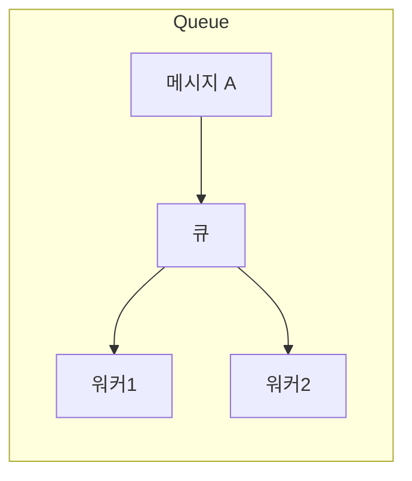
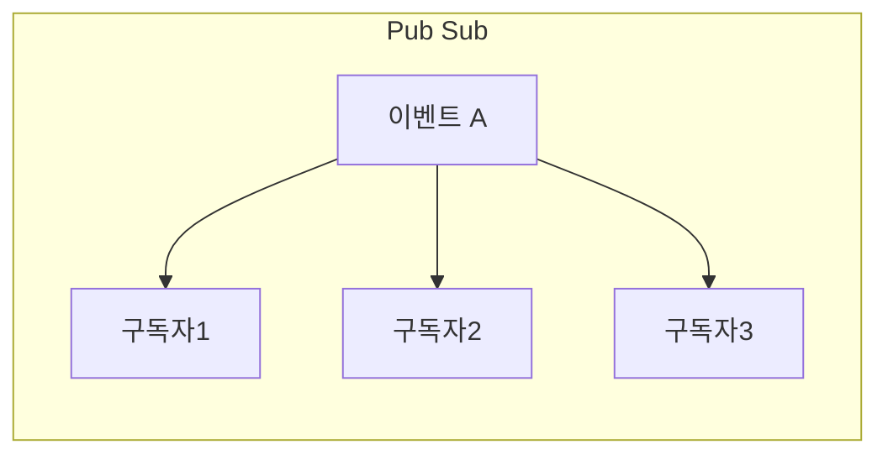

# Queue vs Pub/Sub

**Queue**: 1메시지 → 1소비자 (큐에서 가져가면 사라짐).  
**Pub/Sub**: 1이벤트 → 구독한 전원이 각각 수신.

한 메시지를 **누가 몇 명이 처리하는지**에 따른 두 패턴입니다.

## Queue (큐)

- **한 메시지** → **한 소비자**만 처리 (소비하면 큐에서 사라짐)
- 여러 워커가 같은 큐에서 가져가면, **메시지가 워커들 사이에 분산**됨
- 순서 보장(선입선출)·처리 보장(한 번만 처리)에 유리

## Pub/Sub (발행-구독)

- **한 메시지** → **구독한 모든 구독자**가 각각 받음 (팬아웃)
- 발행자는 “누가 구독하는지” 몰라도 됨. 구독자 추가·제거가 유연함
- 이벤트 알림·복제·동일 이벤트를 여러 서비스가 각자 처리할 때 유리

## 개념 도식

**Queue**: 한 메시지는 워커 중 한 곳에서만 처리됨.

**Pub/Sub**: 한 이벤트를 구독한 모두가 받음.

## 실제 예시

| 구분 | 예시 | 이유 |
|------|------|------|
| **Queue** | 주문 처리 큐, 이메일 발송 큐 | “주문 1건 = 1번만 처리”. 여러 워커가 큐에서 가져가 작업 분산. |
| **Pub/Sub** | “주문 생성됨” 이벤트 → 재고·결제·알림·로그 각각 구독 | 같은 이벤트를 **여러 서비스가 각자** 처리. 한 메시지가 여러 구독자에게 전달. |

## 요약

| 구분 | Queue | Pub/Sub |
|------|-------|---------|
| 1메시지 처리 | 한 소비자 | 여러 구독자 |
| 용도 | 작업 분산(한 번만 처리) | 이벤트 배포(다중 처리) |
| 메시지 소비 후 | 큐에서 제거 | 구독자마다 독립적으로 수신 |
