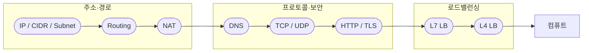
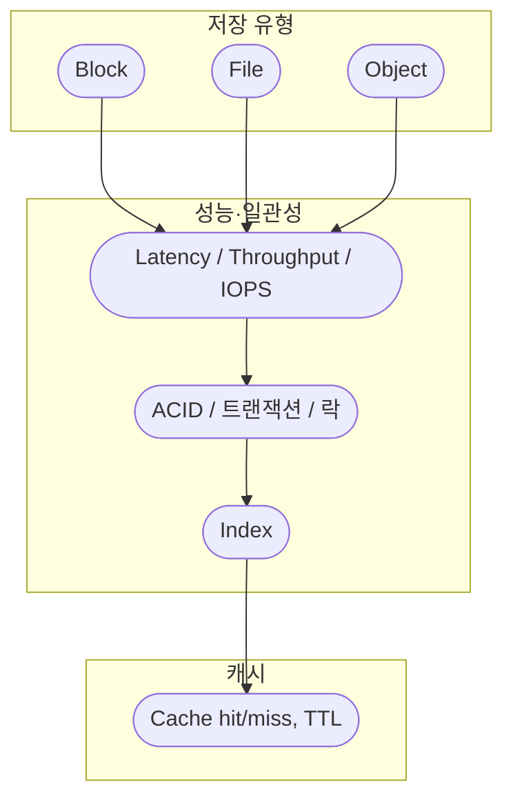
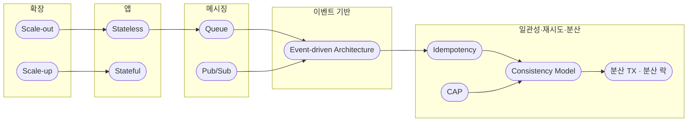
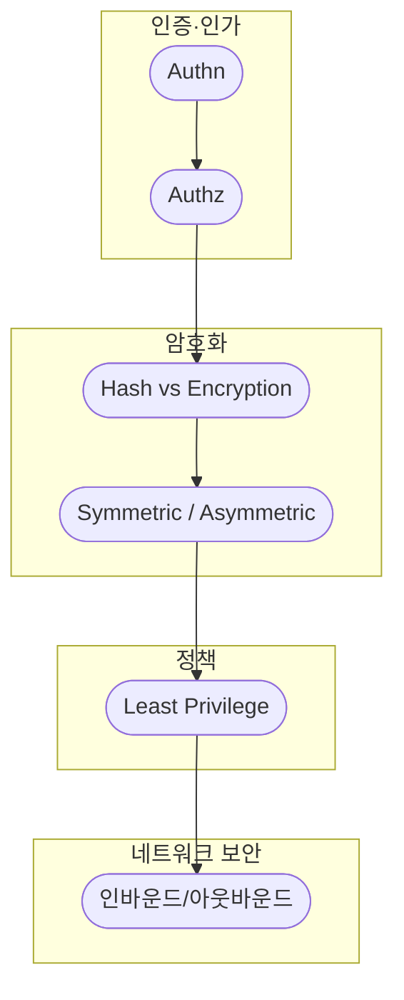
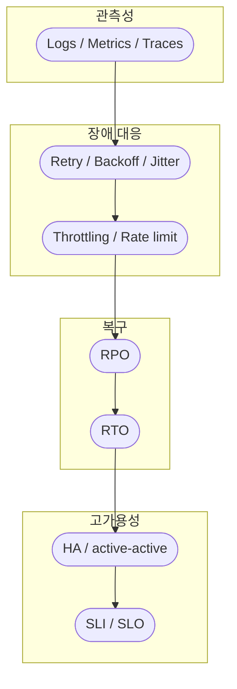
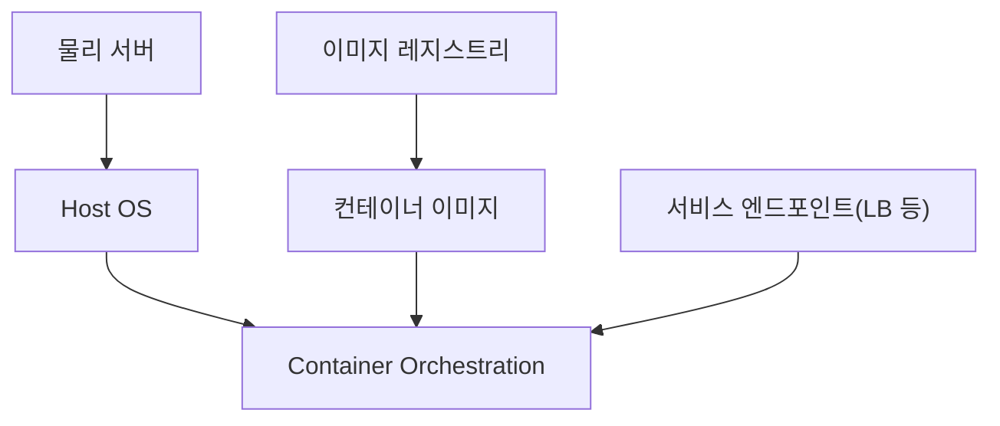

---

## 1. Networking Fundamentals

### 주소 · 라우팅 · NAT · DNS · 프로토콜 · LB

---

## 2. Data & Storage Fundamentals

### Block / File / Object · IOPS · ACID · Index · Cache

---

## 3. Distributed Systems Essentials

### Stateless · Scale · 일관성 · Queue · Idempotency · 분산 TX · 분산 락

---

## 4. Security Basics

### 인증·인가 · 암호화·해시 · 최소 권한 · 네트워크 보안

---

## 5. Reliability & Operations

### 관측성 · 장애 대응 · Throttling · DR · HA · SLO

---

## 6. Containers & Orchestration

---

세부 설명은 각 개념 문서에서 이어서 읽을 수 있습니다.
