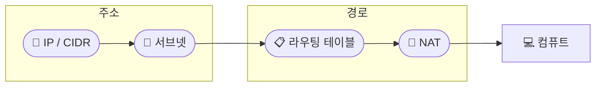
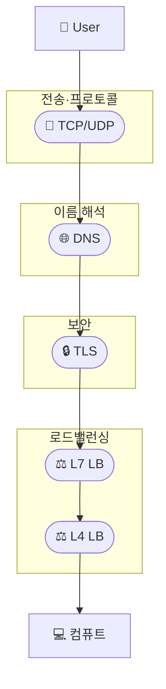
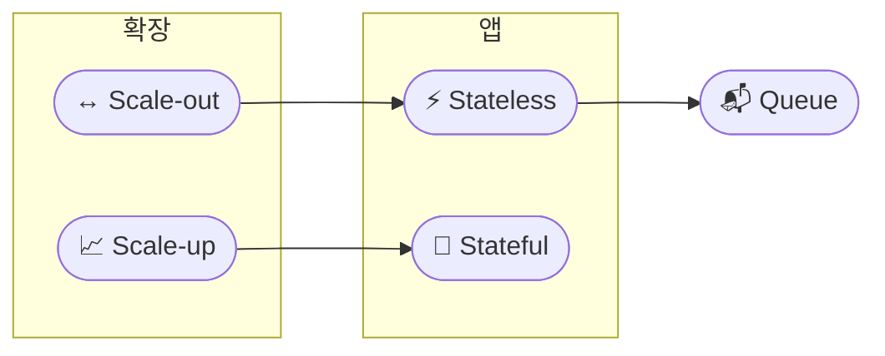
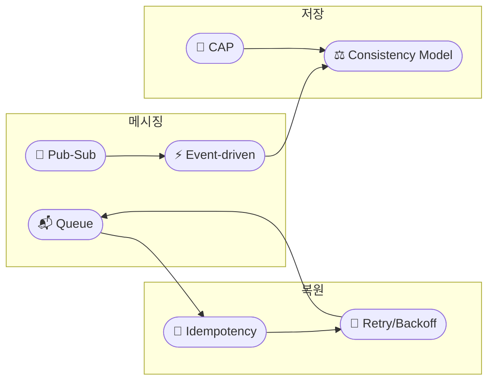
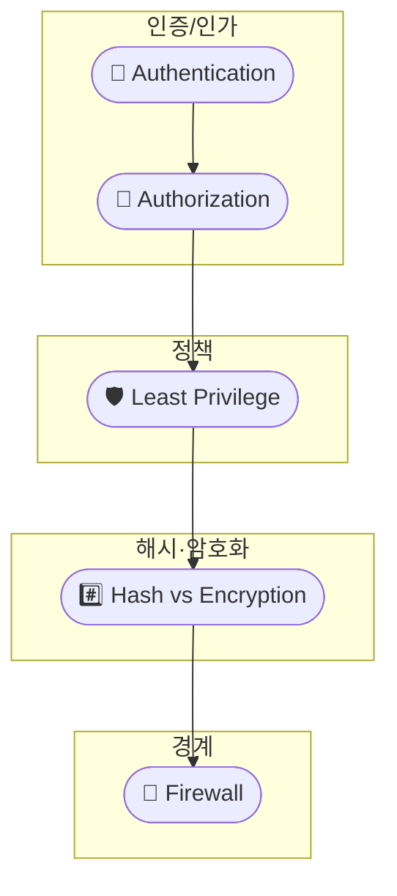
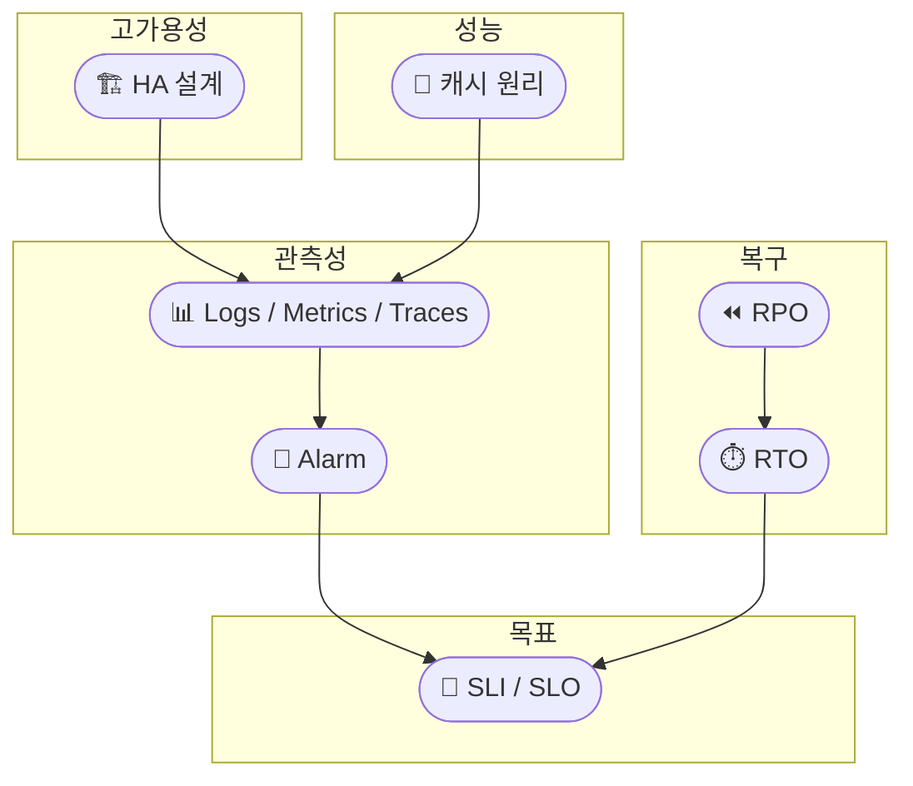

# Core CS · 실제 구조 흐름

네트워크 · 분산 시스템 · 보안 기본 · 운영 & 신뢰성이 **실제 구조에서 어떻게 쓰이는지** 흐름으로만 정리했습니다.  
다이어그램 노드를 클릭하면 해당 개념 문서로 이동합니다.

---

## 1. 네트워크

### 1-1. 주소 · 서브넷 · 라우팅 · NAT

### 1-2. 프로토콜 · DNS · TLS · 로드밸런서

---

## 2. 분산 시스템

### 2-1. 확장 · Stateless · Scale-up / Scale-out

### 2-2. Queue · Pub-Sub · Event-driven · 일관성 · CAP

---

## 3. 보안 기본

### 3-1. 인증 · 인가 · 암호화 · 최소 권한 · 방화벽

---

## 4. 운영 & 신뢰성

### 4-1. HA · 관측성 · 복구 · SLI/SLO · 캐시

---

세부 설명은 각 개념 문서에서 이어서 읽을 수 있습니다.
