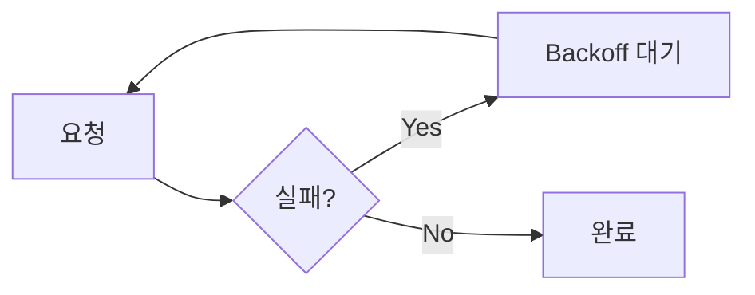
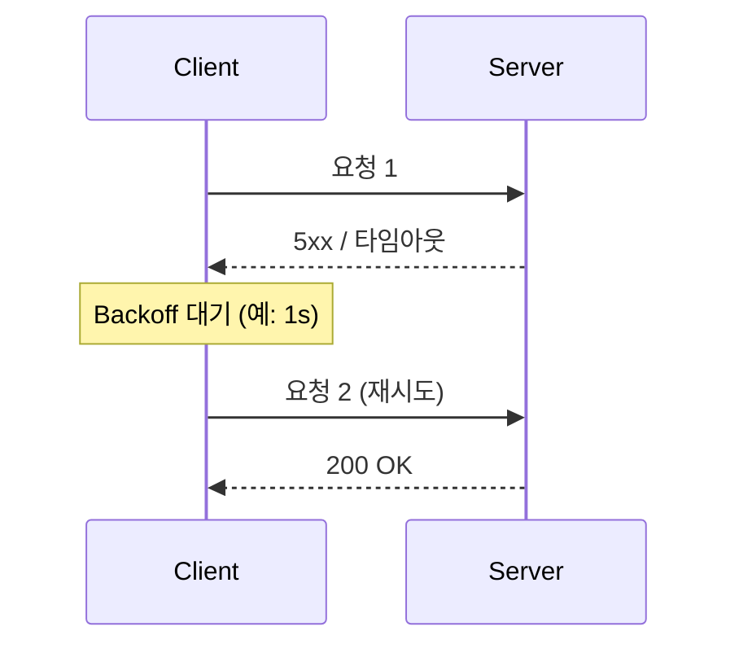

# Retry / Backoff 전략

**실패한 요청을 다시 시도할 때** 어떻게·언제 할지에 대한 전략입니다.

## Retry (재시도)

- 일시적 오류(타임아웃, 5xx, 일시적 네트워크 끊김) 시 **같은 요청을 다시 시도**
- **재시도 가능한 오류**만 재시도: 5xx, 타임아웃, 연결 거부 등
- **재시도하면 안 되는 오류**: 4xx(클라이언트 오류), 결제 실패 등 — 같은 요청을 다시 보내도 성공하지 않음
- 횟수 제한(최대 N회)을 두어 무한 재시도 방지

## Backoff (지연)

- 재시도 **직전에 기다리는 시간**을 두는 것
- 목적: 동시에 실패한 많은 클라이언트가 **동시에** 재시도하면 서버에 부하(Thundering herd) → 대기 시간을 두어 부하 분산

| 방식 | 설명 | 예시 대기 |
|------|------|-----------|
| **Fixed** | 매번 같은 간격 | 1s, 1s, 1s, … |
| **Exponential** | 실패할수록 대기 시간 증가 | 1s → 2s → 4s → 8s … |
| **Jitter** | Exponential + 랜덤 보정 | 1s±0.2 → 2s±0.4 … (동시 재시도 분산) |

## 개념 도식

- **Backoff 없이** 재시도하면 실패한 모든 클라이언트가 동시에 다시 요청 → 서버 부하 재발.
- **Exponential Backoff**로 1초, 2초, 4초… 대기하면 재시도 시점이 흩어져 부하가 완화됨.

## 주의

- **멱등성**: 재시도 시 같은 요청이 여러 번 처리될 수 있으므로, 멱등한 연산이거나 멱등 키로 한 번만 반영되게 설계해야 함.
- **최대 횟수**: N회 초과 시 포기하고 실패로 처리(무한 재시도 방지).

## 요약

| 구분 | 의미 |
|------|------|
| **Retry** | 실패 시 다시 시도 (재시도 가능 오류만, 횟수 제한) |
| **Backoff** | 재시도 전 대기 → 서버·네트워크 부하 완화 |
| **Exponential** | 대기 시간을 점점 늘려 재시도 시점 분산 |
| **Jitter** | 대기 시간에 랜덤을 섞어 동시 재시도 감소 |
