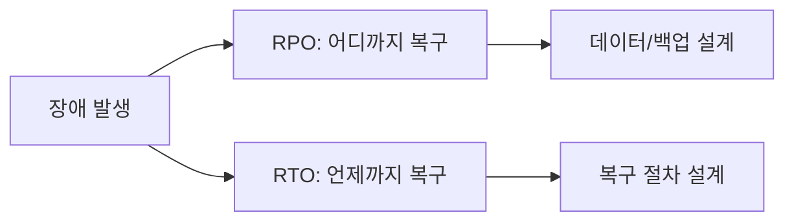

# RTO / RPO

**장애 발생** → **RPO**(어디까지 복구할지, 데이터 손실 허용) · **RTO**(언제까지 복구할지, 다운타임 허용).

복구 목표를 정할 때 쓰는 두 지표입니다.

## RPO (Recovery Point Objective)

- **복구 시점 목표**: 장애가 나도 **어느 시점까지**의 데이터는 복구할 수 있어야 하는가
- 데이터 손실 허용 범위를 시간으로 표현 (예: 1시간 RPO = 최대 1시간치 데이터 손실 허용)
- **백업·복제 주기**를 이 값에 맞춤 (1시간 RPO면 1시간 이내 복제 또는 백업 필요)

## RTO (Recovery Time Objective)

- **복구 시간 목표**: 장애 발생 후 서비스를 **얼마 안에** 다시 올려야 하는가
- 다운타임 허용 범위를 시간으로 표현
- **복구 절차·자동화·대체 시스템** 설계 시 기준이 됨 (RTO가 짧을수록 즉시 전환·자동화 필요)

## 개념 도식

## 실제 예시

| 지표 | 예시 값 | 의미 |
|------|---------|------|
| RPO 1시간 | 백업/복제 1시간 이내 | 최대 1시간치 데이터 손실 허용 |
| RTO 4시간 | 4시간 이내 복구 | 서비스 다운 4시간까지 허용 |

## 요약

| 구분 | RPO | RTO |
|------|-----|-----|
| 질문 | 얼마나 과거까지 복구? | 얼마 안에 복구 완료? |
| 단위 | 시간(데이터 손실) | 시간(다운타임) |
| 영향 | 백업·복제 주기 | 복구 절차·자동화·대체 시스템 |
